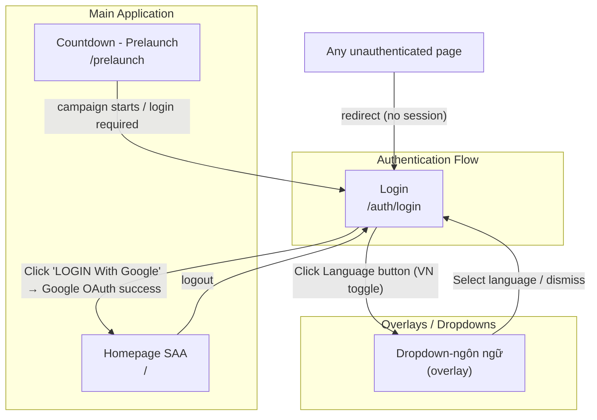
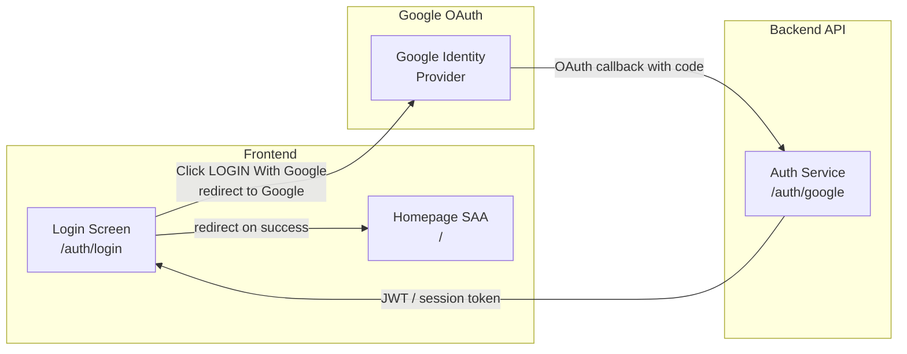

# Screen Flow Overview

## Project Info
- **Project Name**: Sun Annual Awards 2025 (SAA 2025)
- **Figma File Key**: 9ypp4enmFmdK3YAFJLIu6C
- **Figma URL**: https://www.figma.com/design/9ypp4enmFmdK3YAFJLIu6C
- **Created**: 2026-04-08
- **Last Updated**: 2026-04-08

---

## Discovery Progress

| Metric | Count |
|--------|-------|
| Total Screens | 150+ |
| Discovered | 1 |
| Remaining | ~149 |
| Completion | ~1% |

---

## Screens

| # | Screen Name | Frame ID | Figma Link | Status | Detail File | Predicted APIs | Navigations To |
|---|-------------|----------|------------|--------|-------------|----------------|----------------|
| 1 | Login | GzbNeVGJHz | https://www.figma.com/design/9ypp4enmFmdK3YAFJLIu6C?node-id=GzbNeVGJHz | discovered | — | POST /auth/google, GET /auth/me | Homepage SAA, Dropdown-ngôn ngữ |
| 2 | Homepage SAA | i87tDx10uM | https://www.figma.com/design/9ypp4enmFmdK3YAFJLIu6C?node-id=i87tDx10uM | pending | — | — | — |
| 3 | Countdown - Prelaunch page | 8PJQswPZmU | https://www.figma.com/design/9ypp4enmFmdK3YAFJLIu6C?node-id=8PJQswPZmU | pending | — | — | — |
| 4 | Dropdown-ngôn ngữ | hUyaaugye2 | https://www.figma.com/design/9ypp4enmFmdK3YAFJLIu6C?node-id=hUyaaugye2 | pending | — | — | — |

---

## Navigation Graph

---

## Screen Groups

### Group: Authentication
| Screen | Purpose | Entry Points | URL |
|--------|---------|--------------|-----|
| Login | User authentication via Google OAuth | App launch, any unauthenticated route, logout | `/auth/login` |

### Group: Pre-Launch
| Screen | Purpose | Entry Points | URL |
|--------|---------|--------------|-----|
| Countdown - Prelaunch page | Hold page shown before campaign launch | Direct access before event opens | `/prelaunch` |

### Group: Main Application
| Screen | Purpose | Entry Points | URL |
|--------|---------|--------------|-----|
| Homepage SAA | Main hub / landing after login | After successful Google OAuth | `/` |

### Group: Overlays
| Screen | Purpose | Entry Points |
|--------|---------|--------------|
| Dropdown-ngôn ngữ | Language selector overlay | Language button in header (Login, Homepage) |

---

## Login Screen Detail (GzbNeVGJHz)

### Page URL
`/auth/login`

### Interactive Elements
| Element | Type | Action | Navigation Target |
|---------|------|--------|-------------------|
| A.1_Logo | Logo | Non-interactive | — |
| A.2_Language (VN toggle) | Button (toggle) | `on_click` → open language dropdown | Dropdown-ngôn ngữ (overlay) |
| B.3_Login ("LOGIN With Google") | Button (icon+text) | `on_click` → trigger Google OAuth flow | Homepage SAA (`/`) on success |
| D_Footer | Label | Non-interactive | — |

### Navigation FROM Login
| Trigger | Target Screen | Target URL |
|---------|--------------|------------|
| Click "LOGIN With Google" → Google OAuth success | Homepage SAA | `/` |
| Click Language button (VN) | Dropdown-ngôn ngữ | overlay (no route change) |

### Navigation TO Login
| Source | Trigger |
|--------|---------|
| Any unauthenticated route | Automatic redirect (no valid session / token) |
| Countdown - Prelaunch page | Redirect when campaign requires login |
| Any screen with logout action | Explicit logout |

### Authentication Notes
- **No username/password form** — login is exclusively via Google OAuth (`LOGIN With Google` button).
- On click: opens Google OAuth flow; on success returns JWT/session token and redirects to Homepage SAA.
- While processing, the login button is disabled and shows a loading indicator.
- No "Forgot Password" or "Register" screens — Google account handles credential management.

---

## API Endpoints Summary

| Endpoint | Method | Screens Using | Purpose |
|----------|--------|---------------|---------|
| /auth/google | POST/GET | Login | Initiate Google OAuth flow |
| /auth/google/callback | GET | Login (callback) | Handle OAuth callback, issue session |
| /auth/me | GET | Login (post-auth) | Get authenticated user info |

---

## Data Flow

---

## Technical Notes

### Authentication Flow
- Google OAuth 2.0 (no local credentials)
- Session token (JWT) issued by backend after Google callback
- Token stored in cookie or localStorage (TBD per constitution)
- Protected routes check session validity; redirect to `/auth/login` if absent

### Routing
- Router: Next.js App Router
- `/auth/login` — public route (Login screen)
- `/` — protected route (Homepage SAA, requires valid session)
- Unauthenticated access to any protected route → redirect to `/auth/login`

### Language / i18n
- Language selector available on Login screen (header)
- Supported: Vietnamese (VN) — additional languages via Dropdown-ngôn ngữ overlay
- Language selection persists across screens

---

## Discovery Log

| Date | Action | Screens | Notes |
|------|--------|---------|-------|
| 2026-04-08 | Initial discovery | Login (GzbNeVGJHz) | Auth flow documented; Google OAuth only, no register/forgot-password |

---

## Next Steps

- [ ] Discover Homepage SAA (i87tDx10uM) — map post-login navigation
- [ ] Discover Countdown - Prelaunch page (8PJQswPZmU)
- [ ] Discover Admin screens (Admin - Overview, Admin - User, Admin - Setting, etc.)
- [ ] Discover Profile screens (Profile bản thân, Profile người khác)
- [ ] Discover Sun* Kudos flow (Viết Kudo, View Kudo, Gửi lời chúc Kudos)
- [ ] Discover error pages (403, 404)
- [ ] Verify all navigation paths with frontend routing
- [ ] Map all remaining API endpoints
