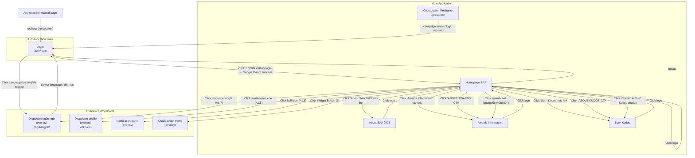
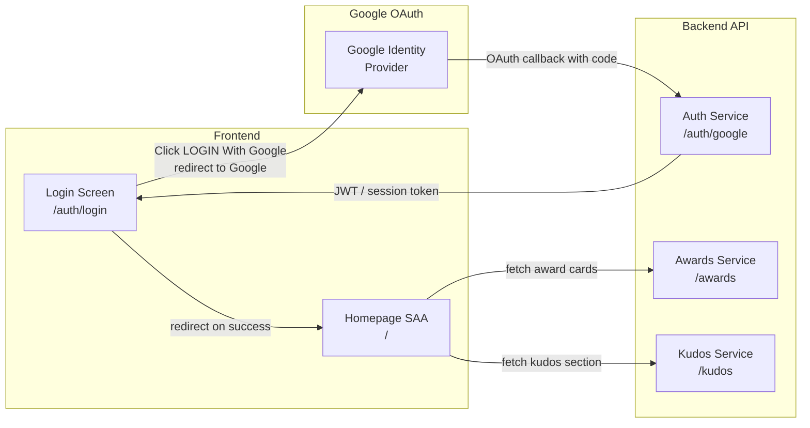

# Screen Flow Overview

## Project Info
- **Project Name**: Sun Annual Awards 2025 (SAA 2025)
- **Figma File Key**: 9ypp4enmFmdK3YAFJLIu6C
- **Figma URL**: https://www.figma.com/design/9ypp4enmFmdK3YAFJLIu6C
- **Created**: 2026-04-08
- **Last Updated**: 2026-04-12

---

## Discovery Progress

| Metric | Count |
|--------|-------|
| Total Screens | 150+ |
| Discovered | 3 |
| Remaining | ~147 |
| Completion | ~2% |

---

## Screens

| # | Screen Name | Frame ID | Figma Link | Status | Detail File | Predicted APIs | Navigations To |
|---|-------------|----------|------------|--------|-------------|----------------|----------------|
| 1 | Login | GzbNeVGJHz | https://www.figma.com/design/9ypp4enmFmdK3YAFJLIu6C?node-id=GzbNeVGJHz | discovered | — | POST /auth/google, GET /auth/me | Homepage SAA, Dropdown-ngôn ngữ |
| 2 | Homepage SAA | i87tDx10uM | https://www.figma.com/design/9ypp4enmFmdK3YAFJLIu6C?node-id=i87tDx10uM | discovered | — | GET /awards, GET /kudos | About SAA 2025, Awards Information, Sun* Kudos, Dropdown-profile, Dropdown-ngôn ngữ, Notification panel, Quick action menu |
| 3 | Countdown - Prelaunch page | 8PJQswPZmU | https://www.figma.com/design/9ypp4enmFmdK3YAFJLIu6C?node-id=8PJQswPZmU | discovered | — | GET event_config (Supabase) | Homepage SAA (on launch + auth), Login (on launch + unauth) |
| 4 | Dropdown-ngôn ngữ | hUyaaugye2 | https://www.figma.com/design/9ypp4enmFmdK3YAFJLIu6C?node-id=hUyaaugye2 | pending | — | — | — |

---

## Navigation Graph

---

## Screen Groups

### Group: Authentication
| Screen | Purpose | Entry Points | URL |
|--------|---------|--------------|-----|
| Login | User authentication via Google OAuth | App launch, any unauthenticated route, logout | `/auth/login` |

### Group: Pre-Launch
| Screen | Purpose | Entry Points | URL |
|--------|---------|--------------|-----|
| Countdown - Prelaunch page | Hold page shown before campaign launch | Direct access before event opens | `/prelaunch` |

### Group: Main Application
| Screen | Purpose | Entry Points | URL |
|--------|---------|--------------|-----|
| Homepage SAA | Main hub / landing after login; links to Awards, Kudos, About SAA sections | After successful Google OAuth; click logo from any page | `/` |
| About SAA 2025 | About the Sun Annual Awards 2025 event | "About SAA 2025" nav link from any main page | TBD |
| Awards Information | Detailed awards listing and individual award detail | "Awards Information" nav link, "ABOUT AWARDS" CTA, award card click | TBD |
| Sun* Kudos | Kudos feature hub | "Sun* Kudos" nav link, "ABOUT KUDOS" CTA, Kudos section "Chi tiết" | TBD |

### Group: Overlays
| Screen | Purpose | Entry Points |
|--------|---------|--------------|
| Dropdown-ngôn ngữ (hUyaaugye2) | Language selector overlay | Language button in header (Login, Homepage SAA) |
| Dropdown-profile (721:5223) | User profile dropdown | Avatar/user icon (A1.8) in Homepage SAA header |
| Notification panel | In-app notifications | Bell icon (A1.6) in Homepage SAA header |
| Quick action menu | Shortcut actions | Widget Button (6) in Homepage SAA |

---

## Login Screen Detail (GzbNeVGJHz)

### Page URL
`/auth/login`

### Interactive Elements
| Element | Type | Action | Navigation Target |
|---------|------|--------|-------------------|
| A.1_Logo | Logo | Non-interactive | — |
| A.2_Language (VN toggle) | Button (toggle) | `on_click` → open language dropdown | Dropdown-ngôn ngữ (overlay) |
| B.3_Login ("LOGIN With Google") | Button (icon+text) | `on_click` → trigger Google OAuth flow | Homepage SAA (`/`) on success |
| D_Footer | Label | Non-interactive | — |

### Navigation FROM Login
| Trigger | Target Screen | Target URL |
|---------|--------------|------------|
| Click "LOGIN With Google" → Google OAuth success | Homepage SAA | `/` |
| Click Language button (VN) | Dropdown-ngôn ngữ | overlay (no route change) |

### Navigation TO Login
| Source | Trigger |
|--------|---------|
| Any unauthenticated route | Automatic redirect (no valid session / token) |
| Countdown - Prelaunch page | Redirect when campaign requires login |
| Any screen with logout action | Explicit logout |

### Authentication Notes
- **No username/password form** — login is exclusively via Google OAuth (`LOGIN With Google` button).
- On click: opens Google OAuth flow; on success returns JWT/session token and redirects to Homepage SAA.
- While processing, the login button is disabled and shows a loading indicator.
- No "Forgot Password" or "Register" screens — Google account handles credential management.

---

## Homepage SAA Screen Detail (i87tDx10uM)

### Page URL
`/`

### Interactive Elements
| Element | Type | Action | Navigation Target |
|---------|------|--------|-------------------|
| Logo | Image/Link | `on_click` → scroll to top (same page) | Homepage SAA (`/`) |
| A1.6 — Bell icon | Icon button | `on_click` → open notification panel | Notification panel (overlay) |
| A1.7 — Language toggle | Button (toggle) | `on_click` → open language dropdown | Dropdown-ngôn ngữ (overlay, hUyaaugye2) |
| A1.8 — Avatar/user icon | Button/Avatar | `on_click` → open profile dropdown | Dropdown-profile (overlay, 721:5223) |
| "About SAA 2025" nav link | Nav link | `on_click` → navigate | About SAA 2025 page |
| "Awards Information" nav link | Nav link | `on_click` → navigate | Awards Information page |
| "Sun* Kudos" nav link | Nav link | `on_click` → navigate | Sun* Kudos page |
| "ABOUT AWARDS" CTA button | Button | `on_click` → navigate | Awards Information page |
| "ABOUT KUDOS" CTA button | Button | `on_click` → navigate | Sun* Kudos page |
| Award card (image/title/"Chi tiết") | Card / Link | `on_click` → navigate with hash | Awards Information page (`#{award-slug}`) |
| "Chi tiết" in Sun* Kudos section | Link/Button | `on_click` → navigate | Sun* Kudos page |
| Widget Button (6) | Floating button | `on_click` → open quick action menu | Quick action menu (overlay) |

### Navigation FROM Homepage SAA
| Trigger | Target Screen | Target URL / Notes |
|---------|--------------|-------------------|
| Click "About SAA 2025" nav link | About SAA 2025 page | TBD |
| Click "Awards Information" nav link | Awards Information page | TBD |
| Click "Sun* Kudos" nav link | Sun* Kudos page | TBD |
| Click "ABOUT AWARDS" CTA button | Awards Information page | TBD |
| Click "ABOUT KUDOS" CTA button | Sun* Kudos page | TBD |
| Click award card (image / title / "Chi tiết") | Awards Information page | `#{award-slug}` hash anchor |
| Click "Chi tiết" in Sun* Kudos section | Sun* Kudos page | TBD |
| Click avatar/user icon (A1.8) | Dropdown-profile | overlay (no route change), frame 721:5223 |
| Click language toggle (A1.7) | Dropdown-ngôn ngữ | overlay (no route change), screen hUyaaugye2 |
| Click bell icon (A1.6) | Notification panel | overlay (no route change) |
| Click Widget Button (6) | Quick action menu | overlay (no route change) |
| Click logo | Homepage SAA | `/` — scroll to top, no route change |

### Navigation TO Homepage SAA
| Source | Trigger |
|--------|---------|
| Login (GzbNeVGJHz) | Successful Google OAuth redirect |
| Any page with logo | Click logo |

### Notes
- The homepage is the main post-login hub, surfacing both the Awards and Sun* Kudos features.
- Award card clicks deep-link to Awards Information with a `#{award-slug}` hash to scroll to the relevant award.
- Header overlays (profile dropdown, language dropdown, notification panel) are all rendered in-place with no URL change.
- Quick action menu (Widget Button 6) is a floating shortcut launcher, also overlay only.

---

## API Endpoints Summary

| Endpoint | Method | Screens Using | Purpose |
|----------|--------|---------------|---------|
| /auth/google | POST/GET | Login | Initiate Google OAuth flow |
| /auth/google/callback | GET | Login (callback) | Handle OAuth callback, issue session |
| /auth/me | GET | Login (post-auth) | Get authenticated user info |
| /awards | GET | Homepage SAA | Fetch awards list for homepage award cards |
| /kudos | GET | Homepage SAA | Fetch kudos data for homepage Sun* Kudos section |

---

## Data Flow

---

## Technical Notes

### Authentication Flow
- Google OAuth 2.0 (no local credentials)
- Session token (JWT) issued by backend after Google callback
- Token stored in cookie or localStorage (TBD per constitution)
- Protected routes check session validity; redirect to `/auth/login` if absent

### Routing
- Router: Next.js App Router
- `/auth/login` — public route (Login screen)
- `/` — protected route (Homepage SAA, requires valid session)
- Unauthenticated access to any protected route → redirect to `/auth/login`

### Language / i18n
- Language selector available on Login screen (header)
- Supported: Vietnamese (VN) — additional languages via Dropdown-ngôn ngữ overlay
- Language selection persists across screens

---

## Discovery Log

| Date | Action | Screens | Notes |
|------|--------|---------|-------|
| 2026-04-08 | Initial discovery | Login (GzbNeVGJHz) | Auth flow documented; Google OAuth only, no register/forgot-password |
| 2026-04-12 | Screen discovery | Homepage SAA (i87tDx10uM) | Post-login hub; nav to Awards, Kudos, About SAA; header overlays (profile, lang, notif); award card deep-links with hash; Widget Button quick action |
| 2026-04-13 | Screen discovery | Countdown - Prelaunch (8PJQswPZmU) | Standalone holding page; countdown timer only; public route; no header/footer; redirects to Login/Homepage on launch |

---

## Countdown - Prelaunch Screen Detail (8PJQswPZmU)

### Page URL
`/prelaunch`

### Interactive Elements
| Element | Type | Action | Navigation Target |
|---------|------|--------|-------------------|
| Countdown Timer | Live display | Auto-updates every 60 seconds | — |

### Navigation FROM Countdown - Prelaunch
| Trigger | Target Screen | Target URL / Notes |
|---------|--------------|-------------------|
| Countdown reaches zero + user authenticated | Homepage SAA | `/` |
| Countdown reaches zero + user NOT authenticated | Login | `/auth/login` |

### Navigation TO Countdown - Prelaunch
| Source | Trigger |
|--------|---------|
| Direct URL access | User visits `/prelaunch` before campaign launch |

### Notes
- This is a PUBLIC route — no authentication required
- Shares keyvisual background with Homepage SAA (different gradient: 18deg vs 12deg)
- Reuses `event_config` table, `fetchEventConfig()` service, and `use-countdown` hook from Homepage SAA
- Countdown uses glass-morphism digit boxes (unique to this page)

---

## Next Steps

- [x] Discover Homepage SAA (i87tDx10uM) — map post-login navigation
- [x] Discover Countdown - Prelaunch page (8PJQswPZmU)
- [ ] Discover Admin screens (Admin - Overview, Admin - User, Admin - Setting, etc.)
- [ ] Discover Profile screens (Profile bản thân, Profile người khác)
- [ ] Discover Sun* Kudos flow (Viết Kudo, View Kudo, Gửi lời chúc Kudos)
- [ ] Discover error pages (403, 404)
- [ ] Verify all navigation paths with frontend routing
- [ ] Map all remaining API endpoints
