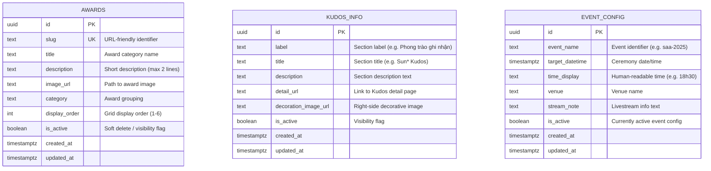

# Implementation Plan: Homepage SAA

**Frame**: `i87tDx10uM-HomepageSAA`
**Date**: 2026-04-13
**Spec**: `specs/i87tDx10uM-HomepageSAA/spec.md`

---

## Summary

Implement the Homepage SAA (`/`) — the main post-login hub of the Sun Annual Awards 2025 application. The page presents a countdown timer to the ceremony, previews the six award categories in a card grid, showcases the Sun* Kudos program, and provides navigation to all major sections (Awards Information, Sun* Kudos, About SAA 2025).

**Key change from v1**: Replace all static mock data with **real Supabase PostgreSQL** tables. The service layer queries Supabase directly from Server Components — no mock data, no API routes needed for read-only homepage content.

The existing `src/app/page.tsx` (Next.js default starter) is replaced entirely. **Existing `Header.tsx` and `Footer.tsx` are NOT modified** — the Login page imports them directly and they must stay intact. Two new layout components (`AppHeader`, `AppFooter`) are created exclusively for the authenticated homepage. New client-only components handle the live countdown timer and the floating Widget Button.

---

## Technical Context

**Language/Framework**: TypeScript / Next.js 15 (App Router)
**Primary Dependencies**: React 19, TailwindCSS v4, `next/image`, `next/link`, Supabase (`@supabase/supabase-js` + `@supabase/ssr`)
**Database**: PostgreSQL 17 via Supabase (3 tables: `awards`, `kudos_info`, `event_config`)
**Testing**: Jest 29, `@testing-library/react`, `@testing-library/jest-dom`
**State Management**: Local React state (`useState`, `useEffect`) for countdown timer and overlay toggles; no global store required
**API Style**: Supabase client SDK direct queries (no REST API routes for homepage reads)

---

## Constitution Compliance Check

*GATE: Must pass before implementation can begin*

- [x] Follows project coding conventions (kebab-case modules, PascalCase components, 2-space indent, single quotes)
- [x] Uses approved libraries and patterns (Next.js App Router, React 19, TailwindCSS v4, Supabase)
- [x] Adheres to folder structure guidelines (`src/components/homepage/`, `src/hooks/`, `src/services/`, `src/types/`)
- [x] Meets security requirements (route protected by existing middleware, RLS on all tables, no secrets in client code)
- [x] Follows testing standards (TDD — tests written and confirmed failing before implementation)

**Violations (if any)**:

| Violation | Justification | Alternative Rejected |
|-----------|---------------|---------------------|
| `Digital Numbers` font (not in constitution's approved list) | Required by Figma spec for countdown digits; display-only, no interactivity | System monospace fonts produce wrong visual appearance per design |
| `SVN-Gotham` font (not in constitution's approved list) | Required by Figma spec for Kudos section decorative text (~96px display); purely decorative | Montserrat at that size looks visually different; design-critical |
| Inline styles with CSS variables instead of Tailwind v4 utilities (Constitution II) | Follows established Login page pattern (`src/app/auth/login/page.tsx` uses identical approach). Changing would require modifying Login page, which is explicitly out of scope. Design spec values (exact px widths, paddings, absolute positions) do not map cleanly to Tailwind utility classes. | Using Tailwind `[var(--token)]` syntax — produces long className strings that are harder to maintain than inline styles with CSS variables; Login refactor out of scope |

**Font loading strategy**:
- Both fonts are NOT on Google Fonts → must be self-hosted under `public/assets/homepage/fonts/`
- Load via `@font-face` declarations in `src/app/globals.css`
- If font files cannot be sourced, fall back to:
  - Digital Numbers → `'Courier New', monospace` (document as known visual gap)
  - SVN-Gotham → `var(--font-montserrat)` (document as known visual gap)

---

## Database Design

### Entity-Relationship Diagram



### Table Definitions

#### `awards`

Stores the 6 award categories displayed in the homepage card grid.

| Column | Type | Constraints | Description |
|--------|------|-------------|-------------|
| `id` | `uuid` | PK, default `gen_random_uuid()` | Primary key |
| `slug` | `text` | UNIQUE, NOT NULL | URL-friendly identifier (e.g. `top-talent`) |
| `title` | `text` | NOT NULL | Award name displayed on card |
| `description` | `text` | NOT NULL | Short description (≤2 lines on card) |
| `image_url` | `text` | NOT NULL | Path to award card image |
| `category` | `text` | NOT NULL | Grouping category |
| `display_order` | `integer` | NOT NULL, default `0` | Controls grid ordering (1–6) |
| `is_active` | `boolean` | NOT NULL, default `true` | Soft visibility toggle |
| `created_at` | `timestamptz` | NOT NULL, default `now()` | Row creation timestamp |
| `updated_at` | `timestamptz` | NOT NULL, default `now()` | Last update timestamp |

**Indexes**:
- `awards_pkey` on `id` (implicit)
- `awards_slug_key` on `slug` (unique)
- `awards_display_order_idx` on `display_order` (for ordered queries)

#### `kudos_info`

Stores the Sun* Kudos section content. Single-row configuration table (one active row at a time).

| Column | Type | Constraints | Description |
|--------|------|-------------|-------------|
| `id` | `uuid` | PK, default `gen_random_uuid()` | Primary key |
| `label` | `text` | NOT NULL | Section label (e.g. "Phong trào ghi nhận") |
| `title` | `text` | NOT NULL | Section title (e.g. "Sun* Kudos") |
| `description` | `text` | NOT NULL | Section description body |
| `detail_url` | `text` | | Link target for "Chi tiết" button |
| `decoration_image_url` | `text` | | Right-side decorative image path |
| `is_active` | `boolean` | NOT NULL, default `true` | Active content flag |
| `created_at` | `timestamptz` | NOT NULL, default `now()` | Row creation timestamp |
| `updated_at` | `timestamptz` | NOT NULL, default `now()` | Last update timestamp |

#### `event_config`

Stores event configuration for the countdown timer and event info section. Single-row configuration table (one active config at a time).

| Column | Type | Constraints | Description |
|--------|------|-------------|-------------|
| `id` | `uuid` | PK, default `gen_random_uuid()` | Primary key |
| `event_name` | `text` | NOT NULL | Event identifier (e.g. "saa-2025") |
| `target_datetime` | `timestamptz` | NOT NULL | Ceremony date/time for countdown |
| `time_display` | `text` | NOT NULL | Human-readable time (e.g. "18h30") |
| `venue` | `text` | NOT NULL | Venue name |
| `stream_note` | `text` | | Livestream information text |
| `is_active` | `boolean` | NOT NULL, default `true` | Currently active config |
| `created_at` | `timestamptz` | NOT NULL, default `now()` | Row creation timestamp |
| `updated_at` | `timestamptz` | NOT NULL, default `now()` | Last update timestamp |

### Row Level Security (RLS)

All tables have RLS enabled. Policies follow least-privilege:

| Table | Policy Name | Operation | Role | Rule |
|-------|-------------|-----------|------|------|
| `awards` | `awards_read_authenticated` | SELECT | `authenticated` | `is_active = true` |
| `awards` | `awards_manage_service` | ALL | `service_role` | `true` (admin/seed) |
| `kudos_info` | `kudos_read_authenticated` | SELECT | `authenticated` | `is_active = true` |
| `kudos_info` | `kudos_manage_service` | ALL | `service_role` | `true` (admin/seed) |
| `event_config` | `event_config_read_authenticated` | SELECT | `authenticated` | `is_active = true` |
| `event_config` | `event_config_manage_service` | ALL | `service_role` | `true` (admin/seed) |

**Why `authenticated` only**: The homepage is protected by middleware — only authenticated users can reach `/`. RLS adds defense-in-depth at the database level.

**Why `service_role` for writes**: Admin screens (pending in SCREENFLOW) will use the `SUPABASE_SECRET_KEY` (service role) for CRUD operations. This keeps the publishable key read-only.

### Auto-update Trigger

A shared `updated_at` trigger function ensures timestamps stay current:

```sql
CREATE OR REPLACE FUNCTION update_updated_at_column()
RETURNS TRIGGER AS $$
BEGIN
  NEW.updated_at = now();
  RETURN NEW;
END;
$$ LANGUAGE plpgsql;
```

Applied to all 3 tables via `BEFORE UPDATE` triggers.

### Seed Data

Development seed file at `supabase/seeds/dev/homepage-seed.sql`:

```sql
-- 6 award categories
INSERT INTO public.awards (slug, title, description, image_url, category, display_order) VALUES
  ('top-talent', 'TOP TALENT', 'Vinh danh những cá nhân tài năng xuất sắc nhất năm với những đóng góp nổi bật.', '/assets/homepage/images/award-top-talent.png', 'individual', 1),
  ('top-project', 'TOP PROJECT', 'Ghi nhận những dự án xuất sắc đã tạo nên giá trị vượt trội cho tổ chức.', '/assets/homepage/images/award-top-project.png', 'team', 2),
  ('top-project-leader', 'TOP PROJECT LEADER', 'Tôn vinh những nhà lãnh đạo dự án đã dẫn dắt đội ngũ đến thành công.', '/assets/homepage/images/award-top-project-leader.png', 'individual', 3),
  ('best-manager', 'BEST MANAGER', 'Vinh danh những quản lý xuất sắc với khả năng lãnh đạo và phát triển đội ngũ.', '/assets/homepage/images/award-best-manager.png', 'individual', 4),
  ('signature-creator', 'SIGNATURE CREATOR', 'Ghi nhận những người sáng tạo đã để lại dấu ấn đặc biệt trong năm.', '/assets/homepage/images/award-signature-creator.png', 'individual', 5),
  ('mvp', 'MVP', 'Tôn vinh cá nhân có đóng góp giá trị nhất, là nguồn cảm hứng cho tổ chức.', '/assets/homepage/images/award-mvp.png', 'individual', 6);

-- Sun* Kudos section
INSERT INTO public.kudos_info (label, title, description, detail_url, decoration_image_url) VALUES
  ('Phong trào ghi nhận', 'Sun* Kudos', 'Sun* Kudos là nền tảng ghi nhận và tôn vinh những đóng góp của nhân viên, giúp xây dựng văn hóa biết ơn và động viên trong tổ chức.', '#', '/assets/homepage/images/kudos-decoration.png');

-- Event configuration
INSERT INTO public.event_config (event_name, target_datetime, time_display, venue, stream_note) VALUES
  ('saa-2025', '2025-12-05T18:30:00+07:00', '18h30', 'Nhà hát Lớn Hà Nội', 'Tường thuật trực tiếp tại website');
```

---

## Architecture Decisions

### Frontend Approach

- **Component Structure**: Feature-based — all homepage-specific components live in `src/components/homepage/`. New authenticated layout components (`AppHeader`, `AppFooter`) live in `src/components/layout/`.
- **Header/Footer isolation** _(critical)_: `src/app/auth/login/page.tsx` imports `Header` and `Footer` directly. **These files MUST NOT be modified.** Create `AppHeader.tsx` and `AppFooter.tsx` as new files:
  - `AppHeader.tsx` — SAA logo + 3 nav links (desktop) / hamburger menu (mobile) + language toggle (reuses `LanguageToggle`) + bell button + avatar button — **Client Component** due to hamburger toggle state
  - `AppFooter.tsx` — SAA logo + nav links (with active state: `rgba(#FFEA9E, 10%)` bg + glow) + copyright in `Montserrat Alternates` (`var(--font-montserrat-alt)`)
  - Login continues using the existing minimal `Header.tsx` + `Footer.tsx`
- **Styling Strategy**: Inline styles with CSS variables (following the Login screen pattern). No Tailwind utility classes for design-spec values; Tailwind only for layout helpers (`flex`, `gap-*`, `items-center`).
- **Data Fetching**:
  - `src/app/page.tsx` is a **Server Component** — calls service functions that query Supabase directly (no fetch, no API routes).
  - `CountdownTimer`, `WidgetButton`, and `AppHeader` are **Client Components** (`'use client'`) due to `setInterval`/state/hamburger toggle.
  - Award cards and Kudos section receive data as props from the page Server Component.
- **Countdown**: Uses `useEffect` + `setInterval` (60-second tick) in `use-countdown.ts` hook. Calculates remaining Days/Hours/Minutes from a target ISO datetime string. Cleans up interval on unmount. Uses `jest.useFakeTimers()` in tests.
- **All navigation uses `next/link` `<Link>` component** (not `<a>` tags) per TR-005. Placeholder `href="#"` with `/* TODO: update when routes confirmed */` comment for TBD routes.
- **AwardCard full-card linking**: The entire `AwardCard` is wrapped in a single `<Link href={href}>` (the container), making the image, title, description, AND "Chi tiết" text all trigger the same navigation. The "Chi tiết →" text is a styled `<span>` inside the link, not a nested `<a>`.
- **Overlay triggers** (language dropdown, profile dropdown, notification panel, quick action menu): Only the trigger buttons are implemented. Overlay content is out-of-scope per spec. Button `onClick` stubs log a `console.log('overlay: ...')` as placeholder.

### Backend Approach — Supabase Direct Queries

**Why no API routes?** The homepage is entirely read-only. Next.js Server Components can call Supabase directly via the server client (`src/libs/supabase/server.ts`). Adding `/api/awards`, `/api/kudos`, `/api/event-config` routes would be unnecessary indirection for data that's fetched server-side and rendered server-side.

**Data access pattern**:
```
page.tsx (Server Component)
  → homepage-service.ts (business logic + queries)
    → src/libs/supabase/server.ts (Supabase server client)
      → Supabase PostgreSQL (RLS-protected)
```

**Service layer** (`src/services/homepage-service.ts`):
```typescript
import { createClient } from '@/libs/supabase/server';
import type { Award, KudosInfo, EventConfig } from '@/types/homepage';

export async function fetchAwards(): Promise<Award[]> {
  const supabase = await createClient();
  const { data, error } = await supabase
    .from('awards')
    .select('id, slug, title, description, image_url, category')
    .eq('is_active', true)
    .order('display_order', { ascending: true });

  if (error) throw error;
  return (data ?? []).map(row => ({
    id: row.id,
    slug: row.slug,
    title: row.title,
    description: row.description,
    imageUrl: row.image_url,
    category: row.category,
  }));
}

export async function fetchKudos(): Promise<KudosInfo | null> {
  const supabase = await createClient();
  const { data, error } = await supabase
    .from('kudos_info')
    .select('label, title, description, detail_url, decoration_image_url')
    .eq('is_active', true)
    .limit(1)
    .single();

  if (error) return null;
  return {
    label: data.label,
    title: data.title,
    description: data.description,
    detailUrl: data.detail_url,
    decorationImageUrl: data.decoration_image_url,
  };
}

export async function fetchEventConfig(): Promise<EventConfig | null> {
  const supabase = await createClient();
  const { data, error } = await supabase
    .from('event_config')
    .select('target_datetime, time_display, venue, stream_note')
    .eq('is_active', true)
    .limit(1)
    .single();

  if (error) return null;
  return {
    targetDatetime: data.target_datetime,
    time: data.time_display,
    venue: data.venue,
    streamNote: data.stream_note,
  };
}
```

**Supabase TypeScript types** — auto-generated via `supabase gen types typescript` after migration, placed at `src/types/supabase.ts`. This provides compile-time safety for all Supabase queries.

### CSS Token Strategy

Tokens already in `globals.css` (from Login — **do not duplicate or overwrite**):

| Token | Existing value | Homepage SAA usage |
|-------|---------------|--------|
| `--color-bg-page` | `#00101a` | Reuse as-is — page background |
| `--color-text-primary` | `#ffffff` | Reuse as-is — body text |
| `--color-divider` | `#2e3940` | Reuse as-is — section dividers |
| `--color-header-bg` | `rgba(11,15,18,0.8)` | **Conflict** — Homepage SAA spec is `rgba(16,20,23,0.8)`; add separate `--color-app-header-bg` |
| `--spacing-header-px` | `144px` | Reuse for `AppHeader` horizontal padding |
| `--spacing-header-py` | `12px` | Reuse for `AppHeader` vertical padding |
| `--spacing-footer-px` | `90px` | Reuse for `AppFooter` horizontal padding |
| `--spacing-footer-py` | `40px` | Reuse for `AppFooter` vertical padding |
| `--border-footer-top` | `1px solid #2e3940` | Reuse for `AppFooter` top border |
| `--font-montserrat` | `var(--font-montserrat-var)` | Reuse — primary font for all text |
| `--font-montserrat-alt` | `var(--font-montserrat-alt-var)` | Reuse — footer copyright text (`Montserrat Alternates 16px/700`) |
| `--radius-btn-login` | `8px` | Same value as `--radius-btn-primary` — but semantically distinct, create new token |

New tokens to ADD to `globals.css` (Homepage SAA only):

| Token | Value |
|-------|-------|
| `--color-app-header-bg` | `rgba(16, 20, 23, 0.8)` |
| `--color-text-gold` | `#FFEA9E` |
| `--color-text-secondary` | `#DBD1C1` |
| `--color-btn-primary-bg` | `#FFEA9E` |
| `--color-btn-primary-text` | `#00101A` |
| `--color-btn-secondary-bg` | `rgba(255, 234, 158, 0.10)` |
| `--color-btn-secondary-border` | `#998C5F` |
| `--color-card-bg` | `#0F0F0F` |
| `--color-card-border` | `#FFEA9E` |
| `--color-nav-active-bg` | `rgba(255, 234, 158, 0.10)` |
| `--color-keyvisual-gradient` | `linear-gradient(12deg, #00101A 23.7%, rgba(0,18,29,0.46) 38.34%, rgba(0,19,32,0) 48.92%)` |
| `--shadow-card-glow` | `0 4px 4px 0 rgba(0,0,0,0.25), 0 0 6px 0 #FAE287` |
| `--text-section-title-size` | `57px` |
| `--text-section-title-weight` | `700` |
| `--text-section-title-line-height` | `64px` |
| `--text-section-caption-size` | `24px` |
| `--text-countdown-digit-size` | `49px` |
| `--text-countdown-label-size` | `24px` |
| `--text-event-value-size` | `24px` |
| `--text-event-label-size` | `16px` |
| `--text-cta-btn-size` | `22px` |
| `--text-nav-link-size` | `14px` |
| `--text-nav-link-footer-size` | `16px` |
| `--text-card-title-size` | `24px` |
| `--text-card-desc-size` | `16px` |
| `--text-kudos-btn-size` | `16px` |
| `--text-widget-slash-size` | `24px` |
| `--font-digital-numbers` | `'Digital Numbers', 'Courier New', monospace` |
| `--font-svn-gotham` | `'SVN-Gotham', var(--font-montserrat)` |
| `--spacing-page-px` | `144px` |
| `--spacing-page-py` | `96px` |
| `--spacing-section-gap` | `120px` |
| `--spacing-awards-grid-gap` | `80px` |
| `--spacing-award-card-gap` | `24px` |
| `--spacing-countdown-gap` | `40px` |
| `--spacing-cta-gap` | `40px` |
| `--spacing-kudos-content-gap` | `32px` |
| `--spacing-footer-nav-gap` | `48px` |
| `--spacing-footer-logo-nav-gap` | `80px` |
| `--radius-award-img` | `24px` |
| `--radius-kudos-card` | `16px` |
| `--radius-btn-primary` | `8px` |
| `--radius-btn-secondary` | `8px` |
| `--radius-btn-details` | `4px` |
| `--radius-widget` | `100px` |
| `--border-award-img` | `0.955px solid #FFEA9E` |
| `--border-section-divider` | `1px solid #2E3940` |

### Integration Points

- **Existing Services**: `src/libs/supabase/server.ts` — used by middleware for session guard AND by `homepage-service.ts` for data queries.
- **Reused Components**: `LanguageToggle` from `src/components/login/LanguageToggle.tsx` — imported by `AppHeader`.
- **Reused Hooks**: `use-language.ts` — already handles localStorage persistence; imported by `AppHeader` via `LanguageToggle`.
- **Database**: Supabase PostgreSQL via `@supabase/supabase-js` — all queries use the server client with cookie-based auth (RLS enforced).

---

## Project Structure

### Documentation (this feature)

```text
.momorph/specs/i87tDx10uM-HomepageSAA/
├── spec.md              # Feature specification
├── design-style.md      # Visual tokens and component specs
├── plan.md              # This file
├── tasks.md             # Task breakdown (next step)
└── assets/
    └── frame.png        # Figma screenshot reference
```

### Database Files

```text
supabase/
├── migrations/
│   └── 20260413000000_create_homepage_tables.sql   # DDL: tables, RLS, triggers
├── seeds/
│   ├── common/.gitkeep
│   └── dev/
│       └── homepage-seed.sql                        # Dev seed: 6 awards + kudos + event config
└── config.toml                                      # Already exists
```

### Source Code — New Files

| File | Purpose | Type |
|------|---------|------|
| `supabase/migrations/20260413000000_create_homepage_tables.sql` | Database migration: creates `awards`, `kudos_info`, `event_config` tables with RLS | SQL Migration |
| `supabase/seeds/dev/homepage-seed.sql` | Development seed data | SQL Seed |
| `src/types/supabase.ts` | Auto-generated Supabase TypeScript types (`supabase gen types`) | Generated Types |
| `src/types/homepage.ts` | Application-level interfaces (`Award`, `KudosInfo`, `EventConfig`) | Types |
| `src/services/homepage-service.ts` | `fetchAwards`, `fetchKudos`, `fetchEventConfig` (Supabase queries) | Service |
| `src/hooks/use-countdown.ts` | Countdown logic: `setInterval` + Days/Hours/Minutes calc | Hook |
| `src/app/page.tsx` | Homepage Server Component (replaces default starter) | Server Component |
| `src/components/layout/AppHeader.tsx` | Authenticated homepage header: logo + nav + controls + mobile hamburger | Client Component (`'use client'`) |
| `src/components/layout/AppFooter.tsx` | Homepage footer: logo + nav links + copyright | Server Component |
| `src/components/homepage/HeroSection.tsx` | Keyvisual background + gradient overlay + ROOT FURTHER image | Server Component |
| `src/components/homepage/CountdownTimer.tsx` | Live countdown wrapper with "Coming soon" label | Client Component (`'use client'`) |
| `src/components/homepage/CountdownUnit.tsx` | Single Days/Hours/Minutes display unit | Presentational |
| `src/components/homepage/EventInfo.tsx` | Time + venue + stream note rows | Server Component |
| `src/components/homepage/CTAButtons.tsx` | "ABOUT AWARDS" + "ABOUT KUDOS" buttons | Server Component |
| `src/components/homepage/RootFurtherSection.tsx` | B4 static placeholder section | Server Component |
| `src/components/homepage/AwardsSection.tsx` | C1 header + C2 award card grid | Server Component |
| `src/components/homepage/AwardCard.tsx` | Single award card — entire card wrapped in `<Link>` | Server Component |
| `src/components/homepage/KudosSection.tsx` | D1 Sun* Kudos dark card | Server Component |
| `src/components/homepage/WidgetButton.tsx` | Fixed floating pill button | Client Component (`'use client'`) |

### Source Code — Modified Files

| File | What Changes |
|------|-------------|
| `src/app/globals.css` | Add Homepage SAA design tokens (new `:root` block, `@font-face` for Digital Numbers + SVN-Gotham, responsive overrides for homepage) |
| `src/app/page.tsx` | Full replacement: Next.js starter → Homepage SAA page structure |
| `src/components/login/LanguageToggle.tsx` | Fix dynamic flag image: replace hardcoded `vn-flag.svg` with `currentLang.flag` from LANGUAGES config; add `flag` field to each language entry pointing to correct asset path |

### Source Code — Unchanged Files (explicitly)

| File | Why unchanged |
|------|--------------|
| `src/components/layout/Header.tsx` | Login-only; must not be modified |
| `src/components/layout/Footer.tsx` | Login-only; must not be modified |
| `src/libs/supabase/server.ts` | Already provides server client — reused as-is by homepage service |
| `src/libs/supabase/client.ts` | Browser client — unchanged |
| `src/libs/supabase/middleware.ts` | Middleware client — unchanged |
| `src/middleware.ts` | Already protects `/`; no changes needed |
| `src/app/auth/layout.tsx` | Auth layout unchanged |
| `src/app/auth/login/page.tsx` | Login page unchanged |

> **Tech debt note**: `LanguageToggle` lives in `src/components/login/` but is reused by `AppHeader`. This cross-module import is acceptable for now given the project's scale. Future refactor: move to `src/components/layout/` and update `Header.tsx` import accordingly.

### Test Files (TDD — created BEFORE implementation)

| File | Tests for |
|------|----------|
| `src/__tests__/services/homepage-service.test.ts` | Supabase queries return correctly typed data; error handling |
| `src/__tests__/hooks/use-countdown.test.ts` | Countdown logic: correct values, zero handling, cleanup |
| `src/__tests__/components/homepage/CountdownTimer.test.tsx` | Renders digits, hides "Coming soon" at zero, updates on tick |
| `src/__tests__/components/homepage/CountdownUnit.test.tsx` | Renders label + digit pair correctly |
| `src/__tests__/components/homepage/EventInfo.test.tsx` | Renders time, venue, note with correct styles |
| `src/__tests__/components/homepage/CTAButtons.test.tsx` | Renders 2 buttons, correct labels, navigation hrefs |
| `src/__tests__/components/homepage/AwardCard.test.tsx` | Renders image, title, desc, link; full-card link href with hash |
| `src/__tests__/components/homepage/AwardsSection.test.tsx` | Renders 6 cards from data array |
| `src/__tests__/components/homepage/KudosSection.test.tsx` | Renders content, "Chi tiết" link navigates correctly |
| `src/__tests__/components/homepage/WidgetButton.test.tsx` | Fixed position rendered, pencil+slash+icon visible |
| `src/__tests__/components/layout/AppHeader.test.tsx` | Logo, 3 nav links, language toggle, bell, avatar present; active nav link has gold style |
| `src/__tests__/components/layout/AppFooter.test.tsx` | Logo, nav links, copyright text present |
| `src/__tests__/components/login/LanguageToggle.test.tsx` | _(already exists)_ — extend with: flag image switches to EN flag when EN is selected |
| `src/__tests__/integration/homepage-service.integration.test.ts` | Integration: real Supabase queries — RLS, ordering, is_active filter, error states (Constitution III.5) |

### Assets — Public Directory

```text
public/assets/homepage/          # NEW directory
├── fonts/
│   ├── digital-numbers.woff2    # Self-hosted (source from design team)
│   └── svn-gotham.woff2         # Self-hosted (source from design team)
├── icons/
│   ├── bell.svg                 # Bell notification icon (24px, white)
│   ├── arrow-right.svg          # Arrow for "Chi tiết →" links (24px)
│   ├── pencil.svg               # Pencil icon for Widget Button (24px, dark)
│   ├── saa-icon.svg             # SAA mini icon for Widget Button (24px)
│   └── en-flag.svg              # English flag for language toggle
├── images/
│   ├── keyvisual.png            # Hero background (from Figma, optimized)
│   ├── root-further-hero.png    # ROOT FURTHER logo for hero (1224×200px)
│   ├── kudos-decoration.png     # Right-side decorative image in Kudos card
│   ├── award-top-talent.png     # Award card image
│   ├── award-top-project.png
│   ├── award-top-project-leader.png
│   ├── award-best-manager.png
│   ├── award-signature-creator.png
│   └── award-mvp.png
└── logos/
    └── saa-logo.png             # REUSE /assets/login/logos/saa-logo.png
                                  # (symlink or copy — same file)
```

**Note on `saa-logo.png`**: The Login and Homepage both use the SAA logo. To avoid duplicating the file, reference the existing path `/assets/login/logos/saa-logo.png` from `AppHeader` and `AppFooter`. If the homepage requires a different size/variant, add a separate file.

### Dependencies

| Package | Version | Purpose | New? |
|---------|---------|---------|------|
| `next/font/local` | (built-in Next.js) | Self-host Digital Numbers + SVN-Gotham fonts | No |
| `@supabase/supabase-js` | ^2.90.1 | Supabase client for DB queries | No (already installed) |
| `@supabase/ssr` | ^0.8.0 | Server-side Supabase client | No (already installed) |
| `supabase` (CLI) | ^2.71.3 | Migrations, type generation, local dev | No (already in devDependencies) |

No new `package.json` dependencies required.

---

## Implementation Strategy

### Phase 0: Database Setup + Asset Preparation

**Goal**: Database tables created, seeded, and all visual assets ready before any component work begins.

#### 0A: Database Migration

1. Create migration file `supabase/migrations/20260413000000_create_homepage_tables.sql`:
   ```sql
   -- ============================================================
   -- Homepage SAA Database Schema
   -- Tables: awards, kudos_info, event_config
   -- ============================================================

   -- 1. Awards table
   CREATE TABLE public.awards (
     id uuid PRIMARY KEY DEFAULT gen_random_uuid(),
     slug text UNIQUE NOT NULL,
     title text NOT NULL,
     description text NOT NULL,
     image_url text NOT NULL,
     category text NOT NULL,
     display_order integer NOT NULL DEFAULT 0,
     is_active boolean NOT NULL DEFAULT true,
     created_at timestamptz NOT NULL DEFAULT now(),
     updated_at timestamptz NOT NULL DEFAULT now()
   );

   CREATE INDEX awards_display_order_idx ON public.awards (display_order);

   COMMENT ON TABLE public.awards IS 'Award categories displayed on the Homepage SAA card grid';

   -- 2. Kudos info table
   CREATE TABLE public.kudos_info (
     id uuid PRIMARY KEY DEFAULT gen_random_uuid(),
     label text NOT NULL,
     title text NOT NULL,
     description text NOT NULL,
     detail_url text,
     decoration_image_url text,
     is_active boolean NOT NULL DEFAULT true,
     created_at timestamptz NOT NULL DEFAULT now(),
     updated_at timestamptz NOT NULL DEFAULT now()
   );

   COMMENT ON TABLE public.kudos_info IS 'Sun* Kudos section content for Homepage SAA';

   -- 3. Event config table
   CREATE TABLE public.event_config (
     id uuid PRIMARY KEY DEFAULT gen_random_uuid(),
     event_name text NOT NULL,
     target_datetime timestamptz NOT NULL,
     time_display text NOT NULL,
     venue text NOT NULL,
     stream_note text,
     is_active boolean NOT NULL DEFAULT true,
     created_at timestamptz NOT NULL DEFAULT now(),
     updated_at timestamptz NOT NULL DEFAULT now()
   );

   COMMENT ON TABLE public.event_config IS 'Event configuration for Homepage SAA countdown and info';

   -- 4. Auto-update trigger for updated_at
   CREATE OR REPLACE FUNCTION public.update_updated_at_column()
   RETURNS TRIGGER AS $$
   BEGIN
     NEW.updated_at = now();
     RETURN NEW;
   END;
   $$ LANGUAGE plpgsql;

   CREATE TRIGGER awards_updated_at
     BEFORE UPDATE ON public.awards
     FOR EACH ROW EXECUTE FUNCTION public.update_updated_at_column();

   CREATE TRIGGER kudos_info_updated_at
     BEFORE UPDATE ON public.kudos_info
     FOR EACH ROW EXECUTE FUNCTION public.update_updated_at_column();

   CREATE TRIGGER event_config_updated_at
     BEFORE UPDATE ON public.event_config
     FOR EACH ROW EXECUTE FUNCTION public.update_updated_at_column();

   -- 5. Row Level Security
   ALTER TABLE public.awards ENABLE ROW LEVEL SECURITY;
   ALTER TABLE public.kudos_info ENABLE ROW LEVEL SECURITY;
   ALTER TABLE public.event_config ENABLE ROW LEVEL SECURITY;

   -- Authenticated users can read active rows
   CREATE POLICY awards_read_authenticated ON public.awards
     FOR SELECT TO authenticated USING (is_active = true);

   CREATE POLICY kudos_read_authenticated ON public.kudos_info
     FOR SELECT TO authenticated USING (is_active = true);

   CREATE POLICY event_config_read_authenticated ON public.event_config
     FOR SELECT TO authenticated USING (is_active = true);

   -- Service role has full access (for admin/seeding)
   CREATE POLICY awards_manage_service ON public.awards
     FOR ALL TO service_role USING (true) WITH CHECK (true);

   CREATE POLICY kudos_manage_service ON public.kudos_info
     FOR ALL TO service_role USING (true) WITH CHECK (true);

   CREATE POLICY event_config_manage_service ON public.event_config
     FOR ALL TO service_role USING (true) WITH CHECK (true);
   ```

2. Create seed file `supabase/seeds/dev/homepage-seed.sql` (see seed data in Database Design section above).

3. Apply migration:
   ```bash
   npx supabase db reset   # for local: drops + recreates + runs migrations + seeds
   ```

4. Generate TypeScript types:
   ```bash
   npx supabase gen types typescript --local > src/types/supabase.ts
   ```

#### 0B: Asset Preparation

1. Download Figma media assets via MoMorph `get_media_files` / `get_media_file`:
   - Keyvisual background → `public/assets/homepage/images/keyvisual.png`
   - ROOT FURTHER hero image → `public/assets/homepage/images/root-further-hero.png`
   - 6 award card images → `public/assets/homepage/images/award-*.png`
   - Kudos decorative image → `public/assets/homepage/images/kudos-decoration.png`
2. Source font files from design team:
   - `digital-numbers.woff2` → `public/assets/homepage/fonts/`
   - `svn-gotham.woff2` → `public/assets/homepage/fonts/`
3. Create/source SVG icons (24px, following existing SVG style in the project):
   - `bell.svg`, `arrow-right.svg`, `pencil.svg`, `saa-icon.svg`, `en-flag.svg`
4. Verify all assets load correctly in Next.js (`next/image`) before proceeding.

**Deliverable**: Database with 3 tables + seed data populated; `public/assets/homepage/` directory fully populated; `src/types/supabase.ts` generated.

---

### Phase 1: Foundation — Types, Services, CSS Tokens

**Goal**: All shared infrastructure in place before UI work starts.

1. **Add Homepage SAA CSS tokens** to `src/app/globals.css`:
   - New `:root` block for Homepage SAA tokens (see CSS Token Strategy table above)
   - `@font-face` declarations for Digital Numbers and SVN-Gotham
   - Responsive overrides for homepage spacing at mobile/tablet breakpoints
2. **Create `src/types/homepage.ts`**:
   ```typescript
   export interface Award {
     id: string;
     slug: string;
     title: string;
     description: string;
     imageUrl: string;
     category: string;
   }
   export interface KudosInfo {
     label: string;
     title: string;
     description: string;
     detailUrl: string | null;
     decorationImageUrl: string | null;
   }
   export interface EventConfig {
     targetDatetime: string; // ISO 8601
     time: string;
     venue: string;
     streamNote: string | null;
   }
   ```
3. **Create `src/services/homepage-service.ts`** with Supabase queries for all 3 service functions (see Backend Approach section).
4. **Create `src/hooks/use-countdown.ts`** — returns `{ days, hours, minutes, isExpired }` from a target ISO datetime string.

**TDD for Phase 1**:
- Write `src/__tests__/services/homepage-service.test.ts` → confirm FAIL → implement → confirm PASS
  - **Service unit tests** mock `@/libs/supabase/server` at the module level (`jest.mock(...)`) to return controlled data shapes. These tests validate the **mapping/transformation logic** (snake_case DB columns → camelCase TS interfaces, null handling, error paths) — they do NOT test DB query correctness.
  - **Service integration tests** (`src/__tests__/integration/homepage-service.integration.test.ts`, Phase 6) use a real local Supabase instance to verify actual queries, RLS policies, and ordering — satisfying **Constitution III.5** ("Unit tests MUST NOT mock the database").
- Write `src/__tests__/hooks/use-countdown.test.ts` → confirm FAIL → implement → confirm PASS

Also in Phase 1: **Fix `LanguageToggle.tsx` flag bug**
- Update `LANGUAGES` array to include a `flag` field:
  ```typescript
  const LANGUAGES = [
    { code: 'vn', label: 'Tiếng Việt', ariaLabel: 'Tiếng Việt', flag: '/assets/login/icons/vn-flag.svg' },
    { code: 'en', label: 'English', ariaLabel: 'English', flag: '/assets/homepage/icons/en-flag.svg' },
  ] as const;
  ```
- Replace `<Image src="/assets/login/icons/vn-flag.svg" ...>` with `<Image src={currentLang.flag} ...>`

---

### Phase 2: Core Features — US1 (Hero + Countdown)

**Goal**: Hero section renders with working countdown, event info, and CTA buttons.

**TDD order** (write test → fail → implement → pass for each):

1. `CountdownUnit.test.tsx` → `CountdownUnit.tsx`
2. `CountdownTimer.test.tsx` → `CountdownTimer.tsx` (Client Component, uses `use-countdown.ts`)
3. `EventInfo.test.tsx` → `EventInfo.tsx`
4. `CTAButtons.test.tsx` → `CTAButtons.tsx`
5. `HeroSection.tsx` (no unit test — layout only, verified visually in browser)
6. Wire up `src/app/page.tsx` with hero section — calls `fetchEventConfig()` from service (reads Supabase)

**Key implementation notes**:
- `page.tsx` calls `fetchEventConfig()` which queries `event_config` table via Supabase server client
- `CountdownTimer` accepts `targetDatetime: string` prop; passes to `use-countdown` hook
- "Coming soon" label: `{!isExpired && <span>Coming soon</span>}`
- CTA buttons use `<Link href="#">` with `{/* TODO: update when /awards route confirmed */}` comment
- `page.tsx` at this point is a minimal Server Component with no header/footer; that is added in Phase 5

---

### Phase 3: Extended Features — US2 (Awards Navigation)

**Goal**: 6 award cards render from database and all 3 navigation paths to Awards Info work.

**TDD order**:

1. `AwardCard.test.tsx` → `AwardCard.tsx`
   - Entire card is `<Link href={`#${award.slug}`}>` wrapping image, title, desc, and "Chi tiết →" span
2. `AwardsSection.test.tsx` → `AwardsSection.tsx` (C1 header + 3-col grid of 6 `AwardCard`)
3. Also create `RootFurtherSection.tsx` — static placeholder, no test needed
4. Extend `src/app/page.tsx`:
   - Calls `fetchAwards()` which queries `awards` table (ordered by `display_order`)
   - Passes award data to `<AwardsSection awards={awards} />`

**Key implementation notes**:
- `RootFurtherSection.tsx`: renders a `<section>` with the correct dimensions (1152×1090px constraint) and a `{/* TODO: replace with content from content team */}` comment
- Award card hover: `transition: transform 200ms ease-out, box-shadow 200ms ease-out` on the `<Link>` container element
- Above-the-fold award card images (first row): `<Image priority />` per TR-003; below-fold: omit `priority` for lazy load
- **Error handling in `page.tsx`**:
  ```typescript
  let awards: Award[] = [];
  try { awards = await fetchAwards(); } catch { /* awards stays [] */ }
  ```
  Pass empty array to `AwardsSection`; it should render an empty state div if `awards.length === 0`

---

### Phase 4: Extended Features — US3 (Kudos Navigation)

**Goal**: Kudos section renders from database and all 3 navigation paths to Sun* Kudos work.

**TDD order**:

1. `KudosSection.test.tsx` → `KudosSection.tsx`
2. Extend `src/app/page.tsx`:
   - Calls `fetchKudos()` which queries `kudos_info` table
   - Passes data to `<KudosSection kudos={kudos} />`

**Key implementation notes**:
- Kudos card inner layout: flex-row, left = text content + "Chi tiết" button, right = decorative side (`kudos-decoration.png` + SVN-Gotham styled text overlay)
- "Chi tiết" button: `<Link href={kudos.detailUrl ?? '#'}>` — URL comes from database
- **Error handling in `page.tsx`**:
  ```typescript
  let kudos: KudosInfo | null = null;
  try { kudos = await fetchKudos(); } catch { /* kudos stays null */ }
  ```
  `KudosSection` receives `kudos: KudosInfo | null`; render a fallback message if `kudos === null`

---

### Phase 5: Header, Footer, Widget Button — US4 + US5

**Goal**: Authenticated header/footer and widget button wired into the page.

**TDD order**:

1. `AppHeader.test.tsx` → `AppHeader.tsx`
2. `AppFooter.test.tsx` → `AppFooter.tsx`
3. `WidgetButton.test.tsx` → `WidgetButton.tsx`
4. Add `<AppHeader>`, `<AppFooter>`, and `<WidgetButton>` to `src/app/page.tsx`

**Key implementation notes**:
- `AppHeader` uses `--color-app-header-bg` token (NOT `--color-header-bg` from Login's `Header`)
- `AppHeader` imports `LanguageToggle` from `src/components/login/LanguageToggle.tsx`
- **Active nav link — concrete approach**: Per the Figma design, **"About SAA 2025"** is the selected/active link when on the homepage (`/`). The homepage conceptually belongs to the "About SAA 2025" section in the nav hierarchy. `AppHeader` accepts `activeNavKey: string` prop. `page.tsx` passes `activeNavKey="about-saa"`. Each nav link is identified by a key (e.g. `about-saa`, `awards`, `kudos`); if the key matches, gold color + underline is applied. No `usePathname()` needed — avoids unnecessary Client Component wrapper.
  ```tsx
  // In page.tsx
  <AppHeader activeNavKey="about-saa" />
  // In AppHeader.tsx
  const NAV_LINKS = [
    { key: 'about-saa', label: 'About SAA 2025', href: '#' },
    { key: 'awards', label: 'Awards Information', href: '#' },
    { key: 'kudos', label: 'Sun* Kudos', href: '#' },
  ] as const;
  const isActive = (key: string) => key === activeNavKey;
  ```
- **Mobile hamburger menu** (per design-style responsive: "nav links hidden (hamburger)" on <768px):
  - `AppHeader` must be a **Client Component** (`'use client'`) to handle hamburger toggle state
  - Desktop (>=768px): nav links displayed inline (flex-row)
  - Mobile (<768px): nav links hidden; a hamburger icon button (`aria-label="Menu"`) toggles a dropdown panel showing the 3 nav links stacked vertically
  - Hamburger icon: 3 horizontal lines (24px, `#FFFFFF`) — use inline SVG or CSS
  - The expanded menu uses `--color-app-header-bg` background, renders below the header bar
  - Close on: link click, outside click, Escape key
- `WidgetButton` onClick: `() => console.log('TODO: open quick action menu overlay')`
- Bell button: `<button aria-label="Thông báo" onClick={() => console.log('TODO: open notifications')}>`
- Avatar button: `<button aria-label="Tài khoản của bạn" onClick={() => console.log('TODO: open profile')}>`

---

### Phase 6: Polish, Responsive & Integration Testing

**Goal**: All responsive breakpoints, hover states, accessibility, performance, and database integration verification.

1. **Responsive CSS** in `globals.css` for homepage-specific tokens at mobile/tablet:
   - `--spacing-page-px`: 144px → 48px (tablet) → 16px (mobile)
   - `--spacing-section-gap`: 120px → 64px (tablet) → 40px (mobile)
   - Award grid: 3-col → 2-col (tablet) → 1-col (mobile) via CSS `grid-template-columns`
   - CTA buttons: row → column stack on mobile
   - Footer: row → column centered on mobile
2. **Hover/focus/active states** (all per design-style.md state tables)
3. **Accessibility** (`aria-label`, `aria-live`, `alt`, keyboard navigation)
4. **Performance** (TR-001 — Lighthouse ≥80): `priority` images, font `display: 'swap'`
5. **Database integration tests** (`src/__tests__/integration/homepage-service.integration.test.ts`):
   - Prerequisite: local Supabase must be running (`supabase start`) with seed data (`supabase db reset`)
   - `fetchAwards()` returns 6 awards ordered by `display_order` from real DB
   - `fetchKudos()` returns active kudos info with correct field mapping
   - `fetchEventConfig()` returns active event config
   - Empty table returns empty array / null (truncate table → query → verify)
   - `is_active = false` rows are filtered by RLS (update row → query → verify not returned)
   - Unauthenticated client cannot read (verify RLS blocks `anon` role)
6. **Manual integration verification**:
   - Run `supabase db reset` → start dev server → verify homepage renders real data
   - Verify Login page still works correctly (no regressions from LanguageToggle fix)

---

## Risk Assessment

| Risk | Probability | Impact | Mitigation |
|------|-------------|--------|------------|
| Digital Numbers / SVN-Gotham font files not available | Medium | Medium | Define fallback fonts in `@font-face`; document as visual gap |
| Keyvisual image very large (perf) | Medium | Medium | Use `next/image` with `sizes="100vw"` + `priority`; check Lighthouse |
| `mix-blend-mode: screen` on award images looks wrong | Low | Medium | Ensure parent container has dark bg; test in Chrome + Firefox |
| Header redesign accidentally affects Login page | Low | High | `Header.tsx` is in "Unchanged Files" list; verify Login visually |
| B4 "Root Further description" content unknown | High | Low | Implement as styled placeholder; `TODO` comment |
| Supabase local dev not running | Medium | Medium | Document `supabase start` prerequisite; add to README dev setup |
| RLS blocks legitimate reads | Low | Medium | Integration test verifies authenticated reads work; seed data visible |
| Schema migration conflicts with future features | Low | Low | Keep tables focused on homepage scope; use Supabase branching for future changes |

### Estimated Complexity

- **Frontend**: High (10 new components, 2 new layout components, responsive, countdown timer, mobile hamburger menu)
- **Backend**: Medium (3 database tables, migration, seed data, Supabase service queries)
- **Testing**: Medium (13 test files, fake timers, Supabase mocking + integration)

---

## Integration Testing Strategy

### Test Scope

- [x] **Component/Module interactions**: `CountdownTimer` ↔ `use-countdown` hook; `AwardCard` ↔ `<Link>` href; `AppHeader` nav links
- [x] **External dependencies**: Supabase server client (mocked in unit tests); `next/navigation` (Link) — mocked via `jest.mock`
- [x] **Data layer**: Supabase PostgreSQL — verified via integration tests with real local Supabase instance
- [x] **User workflows**: Click "ABOUT AWARDS" → verify `href`; click award card → verify `href` includes hash; countdown tick → verify display updates

### Mocking Strategy

| Dependency Type | Strategy | Rationale |
|-----------------|----------|-----------|
| `@/libs/supabase/server` | `jest.mock` returning controlled data shapes | Service unit tests validate mapping logic without DB |
| `next/navigation` | `jest.mock('next/navigation', () => ({ usePathname: () => '/' }))` | Router not available in jsdom |
| `next/image` | `jest.mock('next/image', ...)` | Avoids image loading in tests |
| `use-countdown.ts` | Real + `jest.useFakeTimers()` | Tests actual countdown math |
| Supabase (integration) | Real local Supabase instance | Integration tests hit actual DB per Constitution III.5 |

### Test Scenarios Outline

1. **Happy Path**
   - [x] `fetchAwards()` returns 6 awards ordered by `display_order` from Supabase
   - [x] `fetchKudos()` returns active kudos info from Supabase
   - [x] `fetchEventConfig()` returns active event config from Supabase
   - [x] `CountdownTimer` renders correct Days/Hours/Minutes for a future target date
   - [x] `AwardCard` wraps entire card in `<Link>` with correct `href={#slug}`
   - [x] `AppHeader` renders 3 nav links with correct labels; "About SAA 2025" has active gold style
   - [x] `AppHeader` hamburger menu: hidden on desktop, visible on mobile, toggles nav links panel

2. **Error Handling**
   - [x] When `awards` table is empty, `AwardsSection` renders empty state
   - [x] When `kudos_info` has no active row, `KudosSection` renders fallback
   - [x] When Supabase query fails, service functions throw/return null gracefully

3. **Edge Cases**
   - [x] Countdown shows `00` for all units when target is in the past
   - [x] `use-countdown` cleans up `setInterval` on unmount
   - [x] RLS blocks unauthenticated reads (integration test)
   - [x] `is_active = false` rows are not returned by queries

### Coverage Goals

| Area | Target | Priority |
|------|--------|----------|
| Homepage components | 80%+ | High |
| `use-countdown` hook | 90%+ | High |
| Service Supabase queries | 80%+ | High |
| Navigation `href` correctness | 100% critical paths | High |
| Database integration | Key flows only | Medium |

---

## Dependencies & Prerequisites

### Required Before Start

- [x] `constitution.md` reviewed and understood
- [x] `spec.md` approved (draft — ready for implementation)
- [x] `design-style.md` complete with all component specs
- [x] Supabase project configured (`supabase/config.toml`)
- [x] Supabase client libraries installed (`@supabase/supabase-js`, `@supabase/ssr`)
- [x] Supabase CLI installed (`supabase` devDependency)
- [ ] Local Supabase running (`supabase start`)
- [ ] Digital Numbers font file sourced from design team
- [ ] SVN-Gotham font file sourced from design team
- [ ] Figma assets downloaded (keyvisual, award images, kudos decoration) via Phase 0

### External Dependencies

- **Figma media assets**: Retrieved via MoMorph `get_media_files` during Phase 0B
- **Digital Numbers font** + **SVN-Gotham font**: Must be sourced from design team (woff2 format) and self-hosted
- **Local Supabase**: Must be running for development and integration tests (`supabase start`)

---

## Next Steps

After plan approval:

1. **Run** `supabase start` to ensure local Supabase is running
2. **Run** `/momorph.tasks` to generate the task breakdown for Homepage SAA
3. **Review** `tasks.md` for Phase 0 (DB migration + assets) → Phase 1 (foundation + TDD)
4. **Begin** implementation starting with Phase 0A (database) → Phase 0B (assets) → Phase 1 (foundation) following Red-Green-Refactor cycle

---

## Notes

- `src/app/page.tsx` is currently the default Next.js starter — it will be **fully replaced**. The route `/` is already protected by `src/middleware.ts` (unauthenticated users are redirected to `/auth/login`), so no middleware changes are needed.
- `Header.tsx` is currently used by Login (`src/app/auth/login/page.tsx`). It is intentionally NOT modified. The homepage uses `AppHeader.tsx` instead.
- `Footer.tsx` is currently used by Login. It is intentionally NOT modified. The homepage uses `AppFooter.tsx` instead.
- `B4_Root Further description` (1152×1090px) content is unknown — implement as a styled placeholder with correct dimensions and a `TODO` comment. Do not block implementation waiting for content.
- Award card deep-linking (`#{award-slug}`) requires the Awards Information page to implement scroll-to-anchor. That page is out of scope; the links point to `#${award.slug}` (which currently points nowhere — acceptable for this iteration).
- The Widget Button overlay (Quick Action menu) is out of scope. The button renders with `onClick` stub only.
- All navigation URLs (`/awards`, `/kudos`, `/about-saa`) are `TBD` per SCREENFLOW.md — use `href="#"` with TODO comment until routes are confirmed by the team.
- **Supabase type generation** should be re-run after any migration change: `npx supabase gen types typescript --local > src/types/supabase.ts`.
- **No API routes created** for homepage reads. If future features (admin CRUD) need write endpoints, they should be added as Next.js Route Handlers (`src/app/api/awards/route.ts`) using the `SUPABASE_SECRET_KEY` (service role) for elevated permissions.
