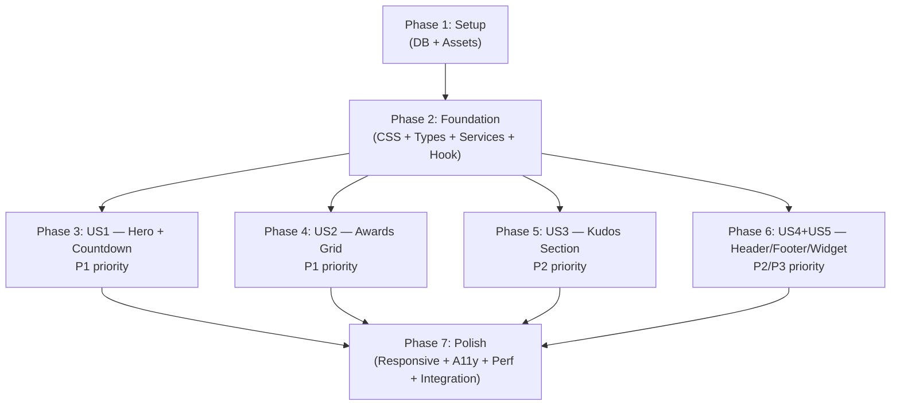

# Tasks: Homepage SAA

**Frame**: `i87tDx10uM-HomepageSAA`
**Prerequisites**: plan.md (required), spec.md (required), design-style.md (required)
**Created**: 2026-04-13

---

## Task Format

```
- [ ] T### [P?] [Story?] Description | file/path
```

- **[P]**: Can run in parallel (different files, no dependencies)
- **[Story]**: Which user story this belongs to (US1–US5)
- **|**: File path(s) affected by this task

---

## Phase 1: Setup (Database + Assets)

**Purpose**: Database tables created, seeded, and all visual assets ready before any component or service work begins.

### Database (Phase 0A from plan)

- [x] T001 Create database migration with 3 tables (awards, kudos_info, event_config), RLS policies, updated_at triggers, and indexes per plan.md Database Design section | `supabase/migrations/20260413000000_create_homepage_tables.sql`
- [x] T002 Create development seed data: 6 awards, 1 kudos_info, 1 event_config per plan.md Seed Data section | `supabase/seeds/dev/homepage-seed.sql`
- [x] T003 Apply migration and seed: run `supabase db reset` (requires local Supabase running via `supabase start`). Verify all 3 tables exist and seed data is populated by querying via Supabase Studio or SQL | `supabase/`
- [x] T004 Generate Supabase TypeScript types: run `npx supabase gen types typescript --local > src/types/supabase.ts`. Verify generated file contains `awards`, `kudos_info`, `event_config` table types | `src/types/supabase.ts`

### Assets (Phase 0B from plan)

- [x] T005 Download Figma media assets via MoMorph `get_media_files`: keyvisual.png, root-further-hero.png, 6 award card images (award-top-talent.png, award-top-project.png, award-top-project-leader.png, award-best-manager.png, award-signature-creator.png, award-mvp.png), kudos-decoration.png | `public/assets/homepage/images/`
- [x] T006 [P] Source SVG icons (24px): bell.svg, arrow-right.svg, pencil.svg, saa-icon.svg, en-flag.svg — create or download from Figma, following existing SVG style in the project | `public/assets/homepage/icons/`
- [x] T007 [P] Source self-hosted font files from design team: digital-numbers.woff2, svn-gotham.woff2. If unavailable, document as known visual gap per plan fallback strategy | `public/assets/homepage/fonts/`
- [x] T008 Verify all assets load correctly in Next.js dev server (`next/image` for images, `@font-face` preview for fonts). No broken paths | `public/assets/homepage/`

**Checkpoint**: Database with 3 tables + seed data populated. `src/types/supabase.ts` generated. `public/assets/homepage/` fully populated.

---

## Phase 2: Foundation (Blocking Prerequisites)

**Purpose**: CSS tokens, TypeScript types, service layer, and countdown hook — ALL user stories depend on these.

**CRITICAL**: No user story work can begin until this phase is complete.

### CSS Tokens

- [x] T009 Add Homepage SAA design tokens to `src/app/globals.css`: new `:root` block with all 35+ tokens from plan CSS Token Strategy table (colors, typography, spacing, radius, borders, shadows). Add `@font-face` declarations for Digital Numbers and SVN-Gotham with `display: swap`. Do NOT duplicate or overwrite existing Login tokens | `src/app/globals.css`

### Types

- [x] T010 [P] Create application-level TypeScript interfaces: `Award` (id, slug, title, description, imageUrl, category), `KudosInfo` (label, title, description, detailUrl, decorationImageUrl), `EventConfig` (targetDatetime, time, venue, streamNote) per plan Phase 1 | `src/types/homepage.ts`

### Service Layer (TDD)

- [x] T011 Write failing unit tests for `homepage-service.ts`: test `fetchAwards()` returns Award[] with correct camelCase mapping from snake_case DB columns, `fetchKudos()` returns KudosInfo or null, `fetchEventConfig()` returns EventConfig or null, error paths return gracefully. Mock `@/libs/supabase/server` at module level | `src/__tests__/services/homepage-service.test.ts`
- [x] T012 Implement `homepage-service.ts` with 3 Supabase query functions: `fetchAwards()` (select + eq is_active + order display_order + map to Award[]), `fetchKudos()` (select + eq is_active + limit 1 + single + map to KudosInfo), `fetchEventConfig()` (select + eq is_active + limit 1 + single + map to EventConfig). See plan Backend Approach section for exact query code | `src/services/homepage-service.ts`
- [x] T013 Run service tests — confirm all PASS | `src/__tests__/services/homepage-service.test.ts`

### Countdown Hook (TDD)

- [x] T014 [P] Write failing unit tests for `use-countdown.ts`: correct Days/Hours/Minutes calculation for future date, returns `isExpired: true` + all zeros when target is past, cleans up `setInterval` on unmount. Use `jest.useFakeTimers()` | `src/__tests__/hooks/use-countdown.test.ts`
- [x] T015 [P] Implement `use-countdown.ts`: accepts target ISO datetime string, returns `{ days, hours, minutes, isExpired }`, uses `useEffect` + `setInterval` with 60-second tick, cleans up interval on unmount | `src/hooks/use-countdown.ts`
- [x] T016 Run countdown hook tests — confirm all PASS | `src/__tests__/hooks/use-countdown.test.ts`

### Bug Fix

- [x] T017 Fix LanguageToggle.tsx flag bug: add `flag` field to LANGUAGES array (`'/assets/login/icons/vn-flag.svg'` for VN, `'/assets/homepage/icons/en-flag.svg'` for EN), replace hardcoded `src="/assets/login/icons/vn-flag.svg"` with `src={currentLang.flag}`. Extend existing LanguageToggle test to verify flag switches to EN flag when EN is selected | `src/components/login/LanguageToggle.tsx`, `src/__tests__/components/login/LanguageToggle.test.tsx`

**Checkpoint**: Foundation ready — CSS tokens in place, types defined, service queries implemented and tested, countdown hook implemented and tested, LanguageToggle bug fixed. User story implementation can now begin.

---

## Phase 3: User Story 1 — View Hero Section & Countdown (Priority: P1)

**Goal**: Hero section renders with working countdown timer, event info, CTA buttons, and real data from Supabase `event_config` table.

**Independent Test**: Render the homepage with seeded event_config data. Verify countdown displays correct remaining time, event info shows time/venue, two CTA buttons are present.

### Tests (US1) — Write FIRST, confirm FAIL

- [x] T018 [P] [US1] Write failing test for CountdownUnit: renders label + digit pair correctly, displays padded numbers | `src/__tests__/components/homepage/CountdownUnit.test.tsx`
- [x] T019 [P] [US1] Write failing test for CountdownTimer: renders 3 CountdownUnits (Days/Hours/Minutes), shows "Coming soon" label when not expired, hides "Coming soon" at zero, updates on tick | `src/__tests__/components/homepage/CountdownTimer.test.tsx`
- [x] T020 [P] [US1] Write failing test for EventInfo: renders "Thời gian:" with time value in gold, "Địa điểm:" with venue in gold, stream note text | `src/__tests__/components/homepage/EventInfo.test.tsx`
- [x] T021 [P] [US1] Write failing test for CTAButtons: renders "ABOUT AWARDS" primary button and "ABOUT KUDOS" secondary button with correct labels, both have Link with href | `src/__tests__/components/homepage/CTAButtons.test.tsx`

### Implementation (US1) — Make tests PASS

- [x] T022 [P] [US1] Implement CountdownUnit component: renders digit value (zero-padded) + label text, uses `--font-digital-numbers` for digits, `--text-countdown-digit-size` / `--text-countdown-label-size` tokens | `src/components/homepage/CountdownUnit.tsx`
- [x] T023 [P] [US1] Implement CountdownTimer component (`'use client'`): uses `use-countdown` hook, renders 3 CountdownUnit components (Days/Hours/Minutes) in row with `--spacing-countdown-gap`, conditionally shows "Coming soon" label when `!isExpired` | `src/components/homepage/CountdownTimer.tsx`
- [x] T024 [P] [US1] Implement EventInfo component: renders time row (label + value), venue row (label + value), stream note. Labels use `--text-event-label-size` white, values use `--text-event-value-size` gold | `src/components/homepage/EventInfo.tsx`
- [x] T025 [P] [US1] Implement CTAButtons component: renders "ABOUT AWARDS" (primary: `--color-btn-primary-bg`, `--radius-btn-primary`) and "ABOUT KUDOS" (secondary: `--color-btn-secondary-bg`, `--color-btn-secondary-border`). Both use `<Link href="#">` with TODO comments. Gap: `--spacing-cta-gap` | `src/components/homepage/CTAButtons.tsx`
- [x] T026 [US1] Implement HeroSection component: keyvisual background image with gradient overlay (`--color-keyvisual-gradient`), ROOT FURTHER logo image (1224x200px), wraps CountdownTimer + EventInfo + CTAButtons. No unit test — layout only, verified visually | `src/components/homepage/HeroSection.tsx`
- [x] T027 [US1] Wire up `page.tsx` as Server Component: call `fetchEventConfig()`, pass `targetDatetime` to CountdownTimer, pass time/venue/streamNote to EventInfo. Add try/catch for graceful error handling. At this point: hero section only, no header/footer | `src/app/page.tsx`
- [x] T028 [US1] Run all US1 tests — confirm all PASS. Visually verify hero section in browser with real Supabase data | `src/__tests__/components/homepage/`

**Checkpoint**: User Story 1 complete — hero with live countdown, event info, and CTAs rendering from real database data.

---

## Phase 4: User Story 2 — Navigate to Awards Information (Priority: P1)

**Goal**: 6 award cards render from database in 3-column grid. Clicking any card navigates to Awards Info with hash anchor.

**Independent Test**: Mount homepage with seeded awards data. Verify 6 cards appear with images, titles, descriptions. Verify card links include `#{award-slug}`.

### Tests (US2) — Write FIRST, confirm FAIL

- [x] T029 [P] [US2] Write failing test for AwardCard: renders image (with gold border, glow shadow), title (gold), description (white, max 2 lines), "Chi tiết →" text. Entire card is wrapped in `<Link href>` with hash anchor | `src/__tests__/components/homepage/AwardCard.test.tsx`
- [x] T030 [P] [US2] Write failing test for AwardsSection: renders C1 header ("Sun* annual awards 2025" caption, divider, "Hệ thống giải thưởng" title in gold). Renders 6 AwardCards in grid from data array. Renders empty state when array is empty | `src/__tests__/components/homepage/AwardsSection.test.tsx`

### Implementation (US2)

- [x] T031 [P] [US2] Implement AwardCard component: `<Link href={`#${award.slug}`}>` wrapping: Image (336x336px, `--radius-award-img`, `--border-award-img`, `--shadow-card-glow`, `mix-blend-mode: screen`), title (`--text-card-title-size`, gold), description (`--text-card-desc-size`, white, line-clamp 2), "Chi tiết →" span (`--text-card-link`). Hover: `translateY(-2px)` + enhanced glow, transition 200ms ease-out. First-row images use `<Image priority />` | `src/components/homepage/AwardCard.tsx`
- [x] T032 [P] [US2] Implement AwardsSection component: C1 header (caption 24px/700 white, divider 1px `--color-divider`, title 57px/700 gold). C2 grid: 3-column layout with `--spacing-awards-grid-gap` gap, maps awards array to AwardCard components. Empty state div when `awards.length === 0` | `src/components/homepage/AwardsSection.tsx`
- [x] T033 [US2] Implement RootFurtherSection component: static placeholder `<section>` with correct dimensions (1152x1090px), `{/* TODO: replace with content from content team */}` comment | `src/components/homepage/RootFurtherSection.tsx`
- [x] T034 [US2] Extend `page.tsx`: call `fetchAwards()` with try/catch (empty array on error), add `<RootFurtherSection />` and `<AwardsSection awards={awards} />` below hero section | `src/app/page.tsx`
- [x] T035 [US2] Run all US2 tests — confirm all PASS. Visually verify award grid in browser with real Supabase data (6 cards, images, hover effects) | `src/__tests__/components/homepage/`

**Checkpoint**: User Stories 1 & 2 complete — hero + countdown + awards grid with real database data.

---

## Phase 5: User Story 3 — Navigate to Sun* Kudos (Priority: P2)

**Goal**: Kudos section renders from database. "Chi tiết" button navigates to Sun* Kudos page.

**Independent Test**: Mount homepage with seeded kudos_info data. Verify dark card renders with label, title, description, "Chi tiết" button. Verify button href comes from database.

### Tests (US3) — Write FIRST, confirm FAIL

- [x] T036 [US3] Write failing test for KudosSection: renders dark card (bg: `#0F0F0F`, radius: 16px) with label (white), title "Sun* Kudos" (gold, 57px), description (white), "Chi tiết" button (gold bg, link href from data). Renders fallback when `kudos` is null. Right-side decorative image present | `src/__tests__/components/homepage/KudosSection.test.tsx`

### Implementation (US3)

- [x] T037 [US3] Implement KudosSection component: outer container 1224px, inner card (`--color-card-bg`, `--radius-kudos-card`). Flex-row: left = D2_Content (label 24px/700 white, title 57px/700 gold, description 16px/700 white justify, "Chi tiết" button `<Link href={kudos.detailUrl ?? '#'}>` bg gold radius 4px). Right = decorative image + SVN-Gotham overlay text. Null kudos renders fallback | `src/components/homepage/KudosSection.tsx`
- [x] T038 [US3] Extend `page.tsx`: call `fetchKudos()` with try/catch (null on error), add `<KudosSection kudos={kudos} />` below awards section | `src/app/page.tsx`
- [x] T039 [US3] Run US3 tests — confirm all PASS. Visually verify kudos section in browser with real Supabase data | `src/__tests__/components/homepage/KudosSection.test.tsx`

**Checkpoint**: User Stories 1–3 complete — hero + awards + kudos, all from real database.

---

## Phase 6: User Stories 4 & 5 — Header, Footer, Widget Button (Priority: P2/P3)

**Goal**: Authenticated sticky header with nav links + mobile hamburger, footer with nav and copyright, floating widget button.

**Independent Test**: Verify header has logo, 3 nav links ("About SAA 2025" active with gold), language toggle, bell, avatar. Verify hamburger menu on mobile. Verify footer renders logo, nav links, copyright. Verify widget button fixed bottom-right.

### Tests (US4 + US5) — Write FIRST, confirm FAIL

- [x] T040 [P] [US4] Write failing test for AppHeader: logo present, 3 nav links with correct labels, "About SAA 2025" has active gold+underline style (via `activeNavKey="about-saa"`), LanguageToggle rendered, bell button with `aria-label="Thông báo"`, avatar button with `aria-label="Tài khoản của bạn"`. Test hamburger: hidden on desktop, visible on mobile viewport, toggles nav panel | `src/__tests__/components/layout/AppHeader.test.tsx`
- [x] T041 [P] [US4] Write failing test for AppFooter: logo present (69x64px), nav links present with correct labels, active link has gold bg style, copyright text uses Montserrat Alternates font, footer has top border | `src/__tests__/components/layout/AppFooter.test.tsx`
- [x] T042 [P] [US5] Write failing test for WidgetButton: has `position: fixed`, renders pencil icon + "/" text + SAA icon, has `aria-label` for accessibility, onClick fires | `src/__tests__/components/homepage/WidgetButton.test.tsx`

### Implementation (US4 + US5)

- [x] T043 [P] [US4] Implement AppHeader component (`'use client'`): sticky top-0 z-10, `--color-app-header-bg` background, 80px height. Left: logo (52x48px from `/assets/login/logos/saa-logo.png`) + nav links (gap 24px, `--text-nav-link-size`). `NAV_LINKS` config with key-based active matching (`activeNavKey` prop). Active: gold color + underline. Right: LanguageToggle (reused from login), bell button, avatar button (all with console.log stubs). Mobile hamburger: useState toggle, hidden >=768px, hamburger icon button on <768px, dropdown panel with stacked nav links. Close on link click / outside click / Escape | `src/components/layout/AppHeader.tsx`
- [x] T044 [P] [US4] Implement AppFooter component: `--border-footer-top` top border, flex space-between. Left: logo (69x64px) + nav links (gap `--spacing-footer-nav-gap`, logo-nav gap `--spacing-footer-logo-nav-gap`). Nav links use `--text-nav-link-footer-size`, active link has `--color-nav-active-bg` bg. Right: copyright text in `var(--font-montserrat-alt)` 16px/700 | `src/components/layout/AppFooter.tsx`
- [x] T045 [P] [US5] Implement WidgetButton component (`'use client'`): `position: fixed; bottom: 32px; right: 19px`, 106x64px, `--color-btn-primary-bg` bg, `--radius-widget` radius, `--shadow-card-glow` shadow. Content: pencil icon (24px) + "/" text (24px/700 `--color-btn-primary-text`) + SAA icon (24px). `onClick={() => console.log('TODO: open quick action menu overlay')}`. Hover: shadow + `translateY(-1px)` 150ms ease-in-out | `src/components/homepage/WidgetButton.tsx`
- [x] T046 [US4] Extend `page.tsx`: add `<AppHeader activeNavKey="about-saa" />` at top, `<AppFooter />` at bottom, `<WidgetButton />` as last child (renders fixed outside scroll content) | `src/app/page.tsx`
- [x] T047 [US4] Run all US4 + US5 tests — confirm all PASS. Visually verify header (desktop + mobile hamburger), footer, and widget button in browser | `src/__tests__/components/layout/`, `src/__tests__/components/homepage/WidgetButton.test.tsx`

**Checkpoint**: All 5 user stories complete — full homepage with header, hero, awards, kudos, footer, widget button.

---

## Phase 7: Polish & Cross-Cutting Concerns

**Purpose**: Responsive breakpoints, hover/focus states, accessibility, performance, and integration testing.

### Responsive CSS

- [x] T048 [P] Add responsive overrides for homepage tokens in `globals.css`: Mobile (<768px) — `--spacing-page-px: 16px`, `--spacing-section-gap: 40px`, award grid 1-col, CTA buttons stack vertically, footer flex-col centered. Tablet (768px-1023px) — `--spacing-page-px: 48px`, `--spacing-section-gap: 64px`, award grid 2-col, kudos inner layout stacked. Per design-style.md Responsive Specifications | `src/app/globals.css`

### Hover, Focus & Active States

- [x] T049 [P] Add all hover/focus/active states per design-style.md Animation & Transitions section: Award cards (`translateY(-2px)` + enhanced glow 200ms), CTA buttons (swap primary/secondary on hover 150ms), nav links (highlight bg 150ms), widget button (shadow + translateY 150ms), focus rings (2px solid white on buttons, rgba(255,255,255,0.5) on cards) | All homepage components

### Accessibility

- [x] T050 [P] Verify and add accessibility: `aria-label` on bell ("Thông báo"), avatar ("Tài khoản của bạn"), hamburger ("Menu"), widget button. `aria-live="polite"` on countdown container. `alt` text on all images (award cards, keyvisual, logos). Keyboard Tab navigation through nav links → CTA buttons → award cards → kudos button → widget button. Focus rings visible | All homepage components

### Performance

- [x] T051 [P] Optimize performance per TR-001 (Lighthouse >=80): above-the-fold images (keyvisual, root-further-hero, first row awards) use `<Image priority />`. Below-fold images use default lazy loading. Fonts use `display: 'swap'` in `@font-face`. Verify no render-blocking CSS. Run Lighthouse audit | `src/components/homepage/`, `src/app/globals.css`

### Integration Testing

- [x] T052 Write integration tests for homepage-service against real local Supabase: `fetchAwards()` returns 6 awards ordered by display_order, `fetchKudos()` returns active kudos, `fetchEventConfig()` returns active config, empty table returns []/null, `is_active=false` rows filtered by RLS, unauthenticated client blocked. Requires `supabase start` + seed data | `src/__tests__/integration/homepage-service.integration.test.ts`

### Manual Verification

- [x] T053 Run `supabase db reset` → start dev server → verify homepage renders all sections with real data. Test empty table states (truncate → verify fallbacks). Verify Login page still works (no regressions from LanguageToggle fix). Test at 375px (mobile), 768px (tablet), 1512px (desktop) breakpoints | Manual browser testing

**Checkpoint**: Full feature complete — responsive, accessible, performant, integration-tested.

---

## Dependencies & Execution Order

### Phase Dependencies



- **Phase 1 (Setup)**: No dependencies — start immediately
- **Phase 2 (Foundation)**: Depends on Phase 1 completion — **BLOCKS all user stories**
- **Phases 3–6 (User Stories)**: All depend on Phase 2 completion. Can run in parallel if team capacity allows, or sequentially P1 → P2 → P3 priority order
- **Phase 7 (Polish)**: Depends on all user story phases complete

### Within Each User Story

1. Tests MUST be written and confirmed FAIL before implementation
2. Implementation makes tests PASS
3. Visual verification in browser after tests pass
4. Story checkpoint before moving to next

### Parallel Opportunities

**Within Phase 1:**
- T006 (icons) and T007 (fonts) can run in parallel with T005 (images)

**Within Phase 2:**
- T010 (types) can run in parallel with T009 (CSS tokens)
- T014-T015 (countdown hook TDD) can run in parallel with T011-T012 (service TDD)

**Within Phase 3 (US1):**
- T018–T021 (all 4 component tests) can run in parallel
- T022–T025 (all 4 component implementations) can run in parallel after their respective tests

**Within Phase 4 (US2):**
- T029–T030 (tests) can run in parallel
- T031–T032 (implementations) can run in parallel after tests

**Within Phase 6 (US4+US5):**
- T040–T042 (all 3 tests) can run in parallel
- T043–T045 (all 3 implementations) can run in parallel after tests

**Within Phase 7:**
- T048–T052 can all run in parallel (different files/concerns)

**Across Phases (if multiple developers):**
- Phase 3 (US1) and Phase 4 (US2) can run in parallel after Phase 2
- Phase 5 (US3) and Phase 6 (US4+US5) can run in parallel after Phase 2

---

## Implementation Strategy

### MVP First (Recommended)

1. Complete Phase 1 (Setup) + Phase 2 (Foundation)
2. Complete Phase 3 (User Story 1 — Hero + Countdown) only
3. **STOP and VALIDATE**: Verify hero section with real Supabase data
4. This delivers the primary landing experience with countdown

### Incremental Delivery

1. Phase 1 + 2 → Foundation ready
2. Phase 3 (US1: Hero) → Test → Commit
3. Phase 4 (US2: Awards) → Test → Commit
4. Phase 5 (US3: Kudos) → Test → Commit
5. Phase 6 (US4+US5: Header/Footer/Widget) → Test → Commit
6. Phase 7 (Polish) → Test → Final commit

### Commit Strategy

- Commit after each phase checkpoint
- Use Conventional Commits format via `/momorph.commit`
- Suggested commit messages:
  - Phase 1: `feat(db): add homepage tables migration and seed data`
  - Phase 2: `feat(homepage): add foundation — types, services, CSS tokens, countdown hook`
  - Phase 3: `feat(homepage): implement hero section with live countdown (US1)`
  - Phase 4: `feat(homepage): implement awards grid section (US2)`
  - Phase 5: `feat(homepage): implement Sun* Kudos section (US3)`
  - Phase 6: `feat(homepage): implement header, footer, widget button (US4+US5)`
  - Phase 7: `feat(homepage): add responsive, accessibility, performance, integration tests`

---

## Summary

| Metric | Count |
|--------|-------|
| **Total tasks** | 53 |
| **Phase 1 (Setup)** | 8 tasks |
| **Phase 2 (Foundation)** | 9 tasks |
| **Phase 3 (US1 — Hero)** | 11 tasks |
| **Phase 4 (US2 — Awards)** | 7 tasks |
| **Phase 5 (US3 — Kudos)** | 4 tasks |
| **Phase 6 (US4+US5 — Header/Footer/Widget)** | 8 tasks |
| **Phase 7 (Polish)** | 6 tasks |
| **Parallel opportunities** | 30 tasks marked [P] |
| **MVP scope** | Phases 1–3 (28 tasks) |

---

## Notes

- All navigation URLs (`/awards`, `/kudos`, `/about-saa`) are TBD per SCREENFLOW.md — use `href="#"` with TODO comment
- `Header.tsx` and `Footer.tsx` are UNCHANGED — Login page uses them directly
- `B4_Root Further description` is a styled placeholder with TODO comment
- Award card deep-links (`#{slug}`) require Awards Information page (out of scope)
- Widget Button and all overlay content (Quick Action menu, notifications, profile) are out of scope — only trigger buttons implemented
- Mark tasks complete as you go: `[x]`
- Run tests before moving to next phase
