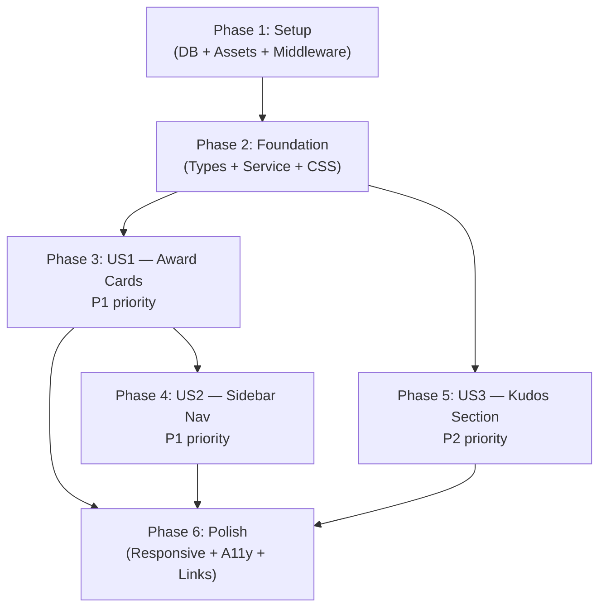

# Tasks: Awards Information (Hệ thống giải thưởng SAA 2025)

**Frame**: `zFYDgyj_pD-AwardsInformation`
**Prerequisites**: plan.md (required), spec.md (required), design-style.md (required)
**Created**: 2026-04-13

---

## Task Format

```
- [x] T### [P?] [Story?] Description | file/path
```

- **[P]**: Can run in parallel (different files, no dependencies)
- **[Story]**: Which user story this belongs to (US1–US3)
- **|**: File path(s) affected by this task

---

## Phase 1: Setup (Database + Assets + Middleware)

**Purpose**: Extend awards schema, update seed data, download hero image, protect route.

### Database

- [x] T001 Create migration to extend awards table: ADD COLUMN `quantity` (integer NOT NULL DEFAULT 1), `unit_type` (text NOT NULL DEFAULT 'Cá nhân'), `prize_value` (text NOT NULL DEFAULT ''). Add column comments | `supabase/migrations/20260413100000_extend_awards_table.sql`
- [x] T002 Update seed file: add UPDATE statements setting quantity/unit_type/prize_value for all 6 awards (Top Talent: 10/Đơn vị/7.000.000 VNĐ, Top Project: 02/Tập thể/15.000.000 VNĐ, Top Project Leader: 03/Cá nhân/7.000.000 VNĐ, Best Manager: 01/Cá nhân/10.000.000 VNĐ, Signature Creator: 01/Cá nhân-Tập thể/5.000.000-8.000.000 VNĐ, MVP: 01/Cá nhân/15.000.000 VNĐ) | `supabase/seeds/dev/homepage-seed.sql`
- [x] T003 Apply migration: run `supabase db reset`. Verify 3 new columns exist and seed data is populated | `supabase/`
- [x] T004 Re-generate Supabase TypeScript types: `npx supabase gen types typescript --local > src/types/supabase.ts`. Verify `quantity`, `unit_type`, `prize_value` appear | `src/types/supabase.ts`

### Assets

- [x] T005 Download Awards hero keyvisual from Figma (`get_figma_image` node `313:8437`, scale 2) — save to `public/assets/awards/images/awards-hero.png`. This is a DIFFERENT image from the Homepage keyvisual | `public/assets/awards/images/`

### Middleware

- [x] T006 Add `/awards` to `PROTECTED_ROUTES` array in middleware. Change from `['/']` to `['/', '/awards']` | `src/middleware.ts`

**Checkpoint**: DB extended, assets ready, route protected.

---

## Phase 2: Foundation (Blocking Prerequisites)

**Purpose**: Types, service, CSS tokens — ALL user stories depend on these.

**CRITICAL**: No user story work can begin until this phase is complete.

### Types + Service (TDD)

- [x] T007 [P] Create `AwardFull` interface extending `Award` with `quantity: number`, `unitType: string`, `prizeValue: string` | `src/types/awards.ts`
- [x] T008 [P] Write failing unit tests for `fetchAwardsFull()`: returns AwardFull[] with correct camelCase mapping (quantity, unitType from unit_type, prizeValue from prize_value), ordered by display_order, throws on error. Mock `@/libs/supabase/server` | `src/__tests__/services/awards-service.test.ts`
- [x] T009 Implement `fetchAwardsFull()` in awards-service: Supabase query selecting all fields including quantity, unit_type, prize_value. Filter `is_active=true`, order by `display_order`. Map snake_case → camelCase | `src/services/awards-service.ts`
- [x] T010 Run service tests — confirm all PASS | `src/__tests__/services/awards-service.test.ts`

### CSS Tokens

- [x] T011 Add awards-page CSS tokens to globals.css: `--spacing-sidebar-width: 200px`, `--spacing-two-col-gap: 238px`, `--spacing-card-stack-gap: 80px`, `--spacing-card-inner-gap: 24px`, `--spacing-meta-gap: 16px`, `--border-sidebar-active: 2px solid #FFEA9E`. Add sidebar nav hover/active/focus CSS classes (`.sidebar-nav-item`, `.sidebar-nav-item-active`). Add responsive overrides: mobile (single-col, horizontal chip bar, image 240px), tablet (narrower gap 48px, sidebar 160px, image 280px) | `src/app/globals.css`

**Checkpoint**: Foundation ready — types, service, CSS tokens in place.

---

## Phase 3: User Story 1 — View Award Details (Priority: P1)

**Goal**: All 6 award detail cards render with image (LEFT), title, description (full text), quantity, and prize value (RIGHT).

**Independent Test**: Render Awards page with mocked award data. Verify 6 horizontal cards with correct content and Vietnamese-formatted prize values.

### Tests (US1) — Write FIRST, confirm FAIL

- [x] T012 [P] [US1] Write failing test for AwardMetaRow: renders label text (e.g. "Số lượng giải thưởng:") and value text (e.g. "10 Đơn vị") in gold | `src/__tests__/components/awards/AwardMetaRow.test.tsx`
- [x] T013 [P] [US1] Write failing test for AwardDetailCard: renders in horizontal layout (flex-row), image on left (336x336px), content on right with title (gold), description (white, full text — NO truncation), 2 metadata rows (quantity + prize). Has `id` attribute matching slug for hash anchor. Has `scroll-margin-top` style | `src/__tests__/components/awards/AwardDetailCard.test.tsx`

### Implementation (US1) — Make tests PASS

- [x] T014 [P] [US1] Implement AwardMetaRow: Props `{ label: string; value: string }`. Label: 16px/400 white. Value: 24px/700 gold. Flex-row with gap | `src/components/awards/AwardMetaRow.tsx`
- [x] T015 [P] [US1] Implement AwardDetailCard: Props `{ award: AwardFull }`. **Horizontal layout** (`flex-row`, gap `--spacing-card-inner-gap`). LEFT: Image 336x336px with gold border, radius 24px, glow shadow, mix-blend-mode screen, `next/image` lazy-load. RIGHT: flex-col content (title 24px/700 gold, description 16px/400 white full text NO clamp, AwardMetaRow for quantity, AwardMetaRow for prize). Container has `id={award.slug}` and `style={{ scrollMarginTop: '96px' }}` | `src/components/awards/AwardDetailCard.tsx`
- [x] T016 [US1] Implement AwardsHeroKeyvisual: full-width hero banner with `/assets/awards/images/awards-hero.png`, cover, centered. No test needed — layout only | `src/components/awards/AwardsHeroKeyvisual.tsx`
- [x] T017 [US1] Implement AwardsSectionTitle: caption "Sun* annual awards 2025" (24px/700 white) + divider + title "Hệ thống giải thưởng SAA 2025" (57px/700 gold, letter-spacing -0.25px). No test needed — layout only | `src/components/awards/AwardsSectionTitle.tsx`
- [x] T018 [US1] Wire `src/app/awards/page.tsx`: Server Component calling `fetchAwardsFull()` + `fetchKudos()` with try/catch. Pass `activeNavKey="awards"` to AppHeader. Render: AppHeader → HeroKeyvisual → SectionTitle → stacked AwardDetailCards (gap `--spacing-card-stack-gap`) → AppFooter. Empty state "Chưa có dữ liệu giải thưởng" if awards is empty. No sidebar yet (added in Phase 4) | `src/app/awards/page.tsx`
- [x] T019 [US1] Run all US1 tests — confirm all PASS. Visually verify award cards in browser | `src/__tests__/components/awards/`

**Checkpoint**: US1 complete — 6 award detail cards rendering with full content.

---

## Phase 4: User Story 2 — Navigate Between Awards (Priority: P1)

**Goal**: Sticky sidebar navigation, click-to-scroll, scroll spy active state, hash anchor on page load.

**Independent Test**: Mount Awards page. Click sidebar "Top Project" → page scrolls to Top Project card. Scroll through cards → sidebar highlights active item. Navigate with `#top-talent` hash → scrolls to correct section.

### Tests (US2) — Write FIRST, confirm FAIL

- [x] T020 [P] [US2] Write failing test for SidebarNavItem: renders label text, calls onClick when clicked, applies active styles when `isActive=true` (gold text + active bg + left border), normal styles when `isActive=false` (white text) | `src/__tests__/components/awards/SidebarNavItem.test.tsx`
- [x] T021 [P] [US2] Write failing test for AwardsSidebar: renders 6 nav items with correct labels. Mock IntersectionObserver. Verify click handler called with slug. Verify active state toggles | `src/__tests__/components/awards/AwardsSidebar.test.tsx`

### Implementation (US2)

- [x] T022 [P] [US2] Implement SidebarNavItem: Props `{ label: string; slug: string; isActive: boolean; onClick: (slug: string) => void }`. Padding 12px 16px, Montserrat 16px/700. Active: gold text + `--color-nav-active-bg` bg + `--border-sidebar-active` left border. Normal: white text. Hover: gold text + subtle bg. Focus: outline. Uses `className="sidebar-nav-item"` / `"sidebar-nav-item-active"` for CSS hooks. `aria-current="true"` when active | `src/components/awards/SidebarNavItem.tsx`
- [x] T023 [US2] Implement AwardsSidebar (`'use client'`): Props `{ slugs: { slug: string; label: string }[] }`. Uses `useState(activeSlug)` + `IntersectionObserver` to track which award section is in viewport (`rootMargin: '-96px 0px -60% 0px'`). On mount, reads `window.location.hash` and scrolls to target with `element.scrollIntoView({ behavior: 'smooth' })`. Click handler: `document.getElementById(slug)?.scrollIntoView({ behavior: 'smooth' })`. Renders `<nav aria-label="Danh mục giải thưởng">` with SidebarNavItems. Sticky: `position: sticky; top: 96px; align-self: flex-start` | `src/components/awards/AwardsSidebar.tsx`
- [x] T024 [US2] Implement AwardsLayout: Props `{ sidebar: React.ReactNode; children: React.ReactNode }`. Flex-row container with gap `--spacing-two-col-gap`. Sidebar on left, children (content) on right with `flex: 1` | `src/components/awards/AwardsLayout.tsx`
- [x] T025 [US2] Update `page.tsx`: wrap cards in AwardsLayout with AwardsSidebar (pass slugs array extracted from awards data). Remove single-column-only layout from Phase 3 | `src/app/awards/page.tsx`
- [x] T026 [US2] Run all US2 tests — confirm all PASS. Visually verify sidebar navigation, scroll spy, and hash anchor in browser | `src/__tests__/components/awards/`

**Checkpoint**: US1 + US2 complete — award cards with sidebar navigation and scroll spy.

---

## Phase 5: User Story 3 — Navigate to Sun* Kudos (Priority: P2)

**Goal**: Sun* Kudos promotional section at the bottom of the page.

**Independent Test**: Scroll past awards. Verify Kudos card renders. Click "Chi tiết" → navigates to Kudos page.

- [x] T027 [US3] Add KudosSection to `page.tsx`: import existing `KudosSection` from `@/components/homepage/KudosSection`. Fetch kudos via `fetchKudos()` (already in try/catch from T018). Render below AwardsLayout | `src/app/awards/page.tsx`
- [x] T028 [US3] Visually verify Kudos section renders correctly on Awards page | Browser

**Checkpoint**: All 3 user stories complete.

---

## Phase 6: Polish & Cross-Cutting Concerns

**Purpose**: Responsive, accessibility, performance, Homepage link updates, full test suite verification.

### Responsive

- [x] T029 [P] Verify responsive CSS: mobile (<768px) sidebar becomes horizontal scrollable chip bar (`flex-direction: row; overflow-x: auto; white-space: nowrap`), cards single-column, images scaled to 240px. Tablet: narrower gap, sidebar 160px, images 280px. Adjust CSS in globals.css if needed | `src/app/globals.css`

### Accessibility

- [x] T030 [P] Verify accessibility: `<nav aria-label="Danh mục giải thưởng">` on sidebar, `aria-current="true"` on active item, focus rings on sidebar items, `alt` text on all award images, `id` on each card section for hash anchors | All awards components

### Performance

- [x] T031 [P] Optimize performance: hero image uses `priority`. Award card images use lazy loading (default). Verify Lighthouse >= 80 | `src/components/awards/`

### Homepage Link Updates

- [x] T032 [P] Update Homepage AwardCard href from `#${slug}` to `/awards#${slug}` — awards page is now live. Verify existing AwardCard tests still pass | `src/components/homepage/AwardCard.tsx`
- [x] T033 [P] Update Homepage CTAButtons "ABOUT AWARDS" href from `#` to `/awards`. Update "ABOUT KUDOS" href from `#` to `#` (still TBD). Verify existing CTAButtons tests still pass | `src/components/homepage/CTAButtons.tsx`

### Full Verification

- [x] T034 Run full test suite (`npx jest --forceExit`) — confirm no regressions across ALL existing tests + new awards tests. Verify build compiles (`npx next build`) | All test files

**Checkpoint**: Feature complete — responsive, accessible, performant, Homepage links updated, all tests green.

---

## Dependencies & Execution Order

### Phase Dependencies



- **Phase 1 (Setup)**: No dependencies — start immediately
- **Phase 2 (Foundation)**: Depends on Phase 1
- **Phase 3 (US1)**: Depends on Phase 2 — cards need types + service
- **Phase 4 (US2)**: Depends on Phase 3 — sidebar needs cards to exist for scroll spy targets
- **Phase 5 (US3)**: Depends on Phase 2 — Kudos section needs fetchKudos only
- **Phase 6 (Polish)**: Depends on all user stories complete

### Parallel Opportunities

**Within Phase 2:** T007 + T008 (types + test) in parallel; T011 (CSS) in parallel with T007-T010

**Within Phase 3:** T012 + T013 (tests) in parallel; T014 + T015 (implementations) in parallel; T016 + T017 (layout components) in parallel

**Within Phase 4:** T020 + T021 (tests) in parallel; T022 (SidebarNavItem) independent from T023 (after tests)

**Within Phase 6:** T029-T033 all in parallel (different files/concerns)

### Reused Infrastructure (no tasks needed)

| Existing Asset | Used By |
|---------------|---------|
| `src/components/homepage/KudosSection.tsx` | Phase 5 — Sun* Kudos section |
| `src/components/layout/AppHeader.tsx` | page.tsx — with `activeNavKey="awards"` |
| `src/components/layout/AppFooter.tsx` | page.tsx — footer |
| `src/services/homepage-service.ts` → `fetchKudos()` | page.tsx — kudos data |
| Homepage CSS tokens (globals.css) | Shared colors, typography, spacing |

---

## Implementation Strategy

### MVP First (Recommended)

1. Complete Phase 1 + 2 (Setup + Foundation)
2. Complete Phase 3 (US1: Award Cards only — no sidebar)
3. **STOP and VALIDATE**: Verify 6 cards render correctly at `/awards`
4. This delivers the core award information

### Incremental Delivery

1. Phase 1 + 2 → Foundation ready
2. Phase 3 (US1: Cards) → Test → Commit
3. Phase 4 (US2: Sidebar + Scroll Spy) → Test → Commit
4. Phase 5 (US3: Kudos) → Test → Commit
5. Phase 6 (Polish + Homepage links) → Test → Final commit

### Commit Strategy

- `feat(db): extend awards table with quantity, unit_type, prize_value`
- `feat(awards): implement award detail cards page (US1)`
- `feat(awards): add sidebar navigation with scroll spy (US2)`
- `feat(awards): add Sun* Kudos section (US3)`
- `feat(awards): add responsive, accessibility, homepage link updates`

---

## Summary

| Metric | Count |
|--------|-------|
| **Total tasks** | 34 |
| **Phase 1 (Setup)** | 6 tasks |
| **Phase 2 (Foundation)** | 5 tasks |
| **Phase 3 (US1 — Award Cards)** | 8 tasks |
| **Phase 4 (US2 — Sidebar Nav)** | 7 tasks |
| **Phase 5 (US3 — Kudos)** | 2 tasks |
| **Phase 6 (Polish)** | 6 tasks |
| **Parallel opportunities** | 18 tasks marked [P] |
| **MVP scope** | Phases 1-3 (19 tasks) |
| **New files** | 11 components + 5 tests + 1 migration = 17 |
| **Modified files** | 5 (globals.css, middleware, seed, AwardCard, CTAButtons) |

---

## Notes

- `fetchAwards()` in homepage-service.ts is NOT modified — Homepage continues using the slim version
- Award detail cards are **horizontal** (`flex-row`: image LEFT, content RIGHT) — different from Homepage vertical cards
- Descriptions show **full text** (no truncation) — different from Homepage 2-line clamp
- KudosSection is imported cross-module from `@/components/homepage/` — acceptable at current scale
- Hash anchors from Homepage `AwardCard` links update from `#slug` → `/awards#slug` in Phase 6
- IntersectionObserver needs mock in tests: `global.IntersectionObserver = jest.fn(...)`
